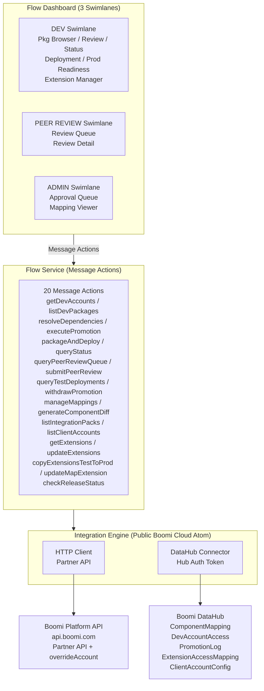
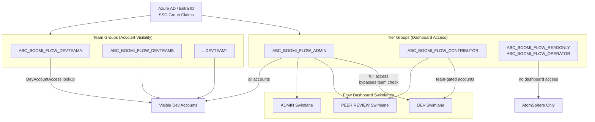
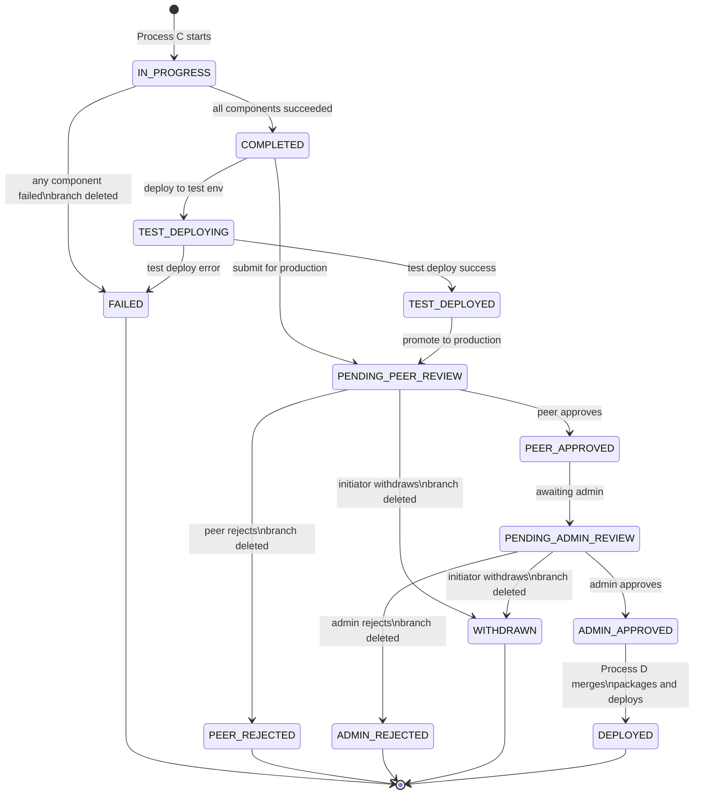
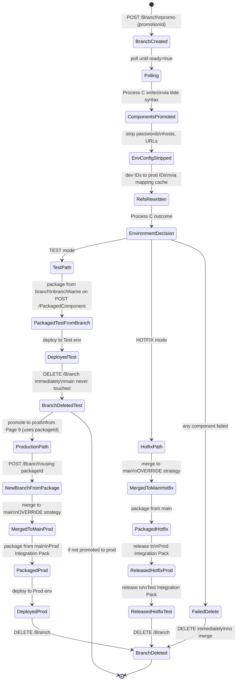
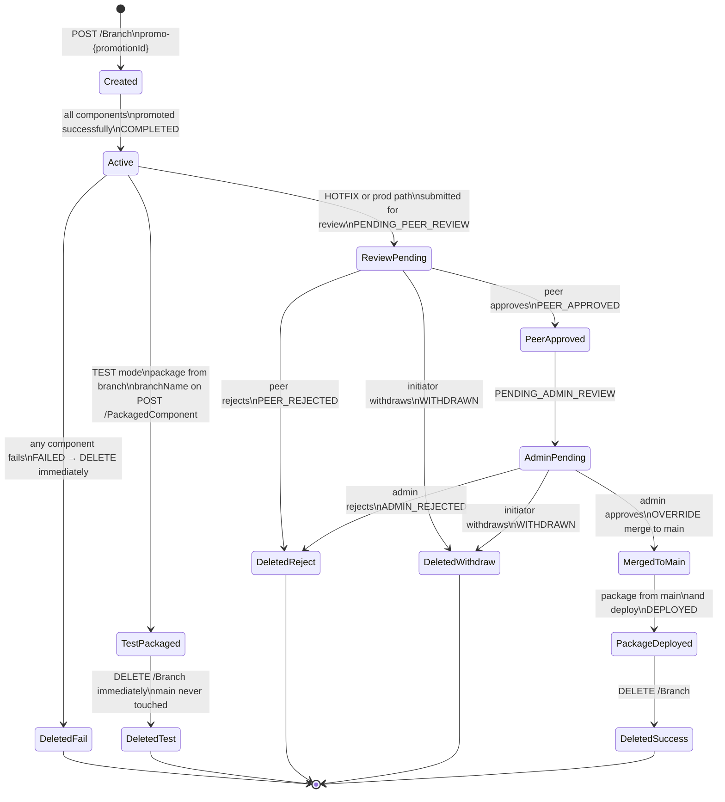

# Boomi Dev-to-Prod Component Promotion System - Architecture

## Problem Statement

Boomi's built-in "Copy Component" creates duplicate components (all Version 1) when copying between accounts. No version continuity, no update-in-place.

## Solution

A Boomi Flow dashboard where devs promote packaged processes from a dev sub-account to the primary account via Platform API, maintaining a single master component with incremental versions. A 2-layer approval workflow (peer review + admin review) gates Integration Pack deployment.

## Architecture Overview



## Key Design Decisions

### Why Message Actions (Not Data Actions)
Logic is too complex for simple CRUD — recursive dependency traversal, XML manipulation, reference rewriting. Message Actions give full control over request/response JSON profiles and custom Integration process logic.

### Why Public Boomi Cloud Atom
No firewall issues. Flow → Integration → DataHub all within Boomi's cloud infrastructure.

### Why DataHub (Not External DB)
External databases have 30+ second latency due to firewall/domain limitations. DataHub is accessible without latency when Integration atom is on public Boomi cloud. Match rules provide built-in UPSERT behavior.

### Why Flow Services Server
Single Flow Service component defines the contract. Exposes all 13 processes as Message Actions. Handles connection management, timeout callbacks, and authentication automatically.

### Why Swimlanes for Approval
Built-in Flow authorization containers. Three swimlanes implement a 2-layer approval workflow: Dev swimlane for submission, Peer Review swimlane for first approval gate (any dev or admin except submitter), Admin swimlane for final approval and deployment. SSO group restrictions on each swimlane. Flow pauses at each boundary waiting for the next authenticated user.

### Why 2-Layer Approval (Peer Review + Admin)
Peer review catches process logic and configuration issues that automated checks miss. Self-review prevention enforced at both UI level (Flow business rules on `$User/Email`) and backend level (Process E3 compares `reviewerEmail` with `initiatedBy`). Admins only see promotions that have passed peer scrutiny, reducing their review burden.

### Why Boomi Branching for Promotion

Components are promoted to a temporary branch (not main) so reviewers can see what actually changed via side-by-side XML diff. The branch lifecycle differs by deployment mode:

- **Test mode (Mode 1):** Process C creates branch `promo-{promotionId}` and promotes components there. Process D packages **directly from the branch** using the `branchName` field on `POST /PackagedComponent`, then **deletes the branch immediately** after packaging. Main is never touched for test deployments.
- **Production mode (Mode 2):** Process D creates a **new branch from the test PackagedComponent** (using `packageId` on `POST /Branch`), merges that branch to main (OVERRIDE), packages from main, then deletes the branch. This is the first (and only) time main is updated.
- **Hotfix mode (Mode 3):** Process C creates the branch, Process D merges to main (OVERRIDE), packages from main, dual-releases to prod then test, then deletes the branch.
- **Process G** fetches both `Component/{id}~{branchId}` (branch) and `Component/{id}` (main) for diff comparison during review.
- **Rejection or denial** simply deletes the branch — main is never touched.

**Key invariant:** Main branch is protected during test deployments. Only admin-approved production deployments (Mode 2) and hotfixes (Mode 3) ever merge to main.

### Why OVERRIDE Merge Strategy

The `OVERRIDE` strategy with `priorityBranch` set to the promotion branch ensures:
- Branch components overwrite main — no manual conflict resolution
- Fully programmatic via API (no Boomi UI interaction required)
- Safe because Process C is the sole writer to each promotion branch

### Why Admin Integration Pack Ownership

Integration Pack selection is an admin-only function, managed from the Admin Approval Queue (Page 7). The system enforces this for two reasons:

- **Returning packages:** For a `processName` + `targetEnvironment` combination seen before, the system auto-detects the correct Integration Pack from PromotionLog history and pre-fills the selection. Admins confirm or override.
- **Brand-new packages:** When no history exists, the PromotionLog enters `PENDING_PACK_ASSIGNMENT` status, signaling that admin action is needed before deployment can proceed.

This prevents developers from accidentally creating duplicate Integration Packs or deploying to the wrong pack. Admins see a multi-package view when selecting an existing IP to avoid accidentally dropping packages from a release — a risk unique to the Boomi Integration Pack model where a single release covers all attached packages.

### 20-Branch Limit Management

Boomi enforces a hard limit of 20 branches per account. All branches are now **short-lived** in every mode, which is a significant improvement over the previous design:

- **Test branches:** Created by Process C, deleted by Process D immediately after packaging from the branch (minutes — not days or weeks)
- **Production branches:** Created and deleted entirely within Process D prod mode (minutes)
- **Hotfix branches:** Created by Process C, deleted by Process D after dual-release (minutes to hours)
- Checking branch count before creation (Process C fails with `BRANCH_LIMIT_REACHED` if >= 15)
- Deleting branches on ALL terminal paths (approve, reject, deny, withdrawal)
- Tracking `branchId` in PromotionLog (set to null after cleanup)

This short-lived branch strategy dramatically reduces branch slot pressure compared to the previous design where test branches persisted through the test→production lifecycle. The branch age column on Page 9 remains useful for deployment age tracking even though stale branch risk is substantially lower.

### Why Two-Axis SSO Groups

Authorization uses a two-axis model based on Azure AD/Entra SSO group names:

**Axis 1 — Team groups** (account visibility):
- Named `ABC_BOOMI_FLOW_DEVTEAMA`, `ABC_BOOMI_FLOW_DEVTEAMB`, etc.
- Mapped to dev sub-accounts via DevAccountAccess DataHub model
- Process A0 queries DataHub filtering by the user's team groups to determine which dev accounts they can see

**Axis 2 — Tier groups** (dashboard access and capabilities):
- `ABC_BOOMI_FLOW_ADMIN` — full dashboard access, bypasses team check (sees all accounts)
- `ABC_BOOMI_FLOW_CONTRIBUTOR` — Developer + Peer Review swimlane access, account visibility governed by team groups
- `ABC_BOOMI_FLOW_READONLY` / `ABC_BOOMI_FLOW_OPERATOR` — AtomSphere access only, zero dashboard access

**Tier resolution algorithm** (Process A0, re-validated in Process C):
```
if userSsoGroups contains "ABC_BOOMI_FLOW_ADMIN" → ADMIN
else if userSsoGroups contains "ABC_BOOMI_FLOW_CONTRIBUTOR" → CONTRIBUTOR
else → READONLY (no dashboard access)
```

**Key design points:**
- Tiers are resolved at runtime from SSO group names — not stored in DataHub
- ADMIN bypasses the team check entirely and returns ALL active DevAccountAccess records
- Non-dashboard tiers (READONLY, OPERATOR) cannot reach the dashboard; the algorithm handles them as a fallback
- Defense-in-depth: Process C re-validates the tier from the `userSsoGroups` array passed in the executePromotion request, rejecting with `INSUFFICIENT_TIER` if below CONTRIBUTOR
- Per-button tier gating is unnecessary — swimlane authorization already enforces CONTRIBUTOR/ADMIN access

### Authorization Flow

The two-axis SSO model maps group membership to dashboard access and account visibility.



## Constraints
- Flow State is temporary/auto-purged — not usable for persistent storage
- Starting fresh — no pre-existing components to seed
- Multiple dev sub-accounts — two-axis SSO model: team groups for account visibility, tier groups for dashboard access
- Existing private cloud atom handles current work; new public cloud atom for Flow Services
- Azure AD/Entra SSO already configured in Flow
- Partner API enabled on primary account
- Promoted components mirror the dev account's folder structure under `/Promoted/` (e.g., dev path `/DevTeamARoot/Orders/MyProcess/` becomes `/Promoted/DevTeamARoot/Orders/MyProcess/` in primary)
- Connection components are NOT promoted — they are pre-configured once in the parent account under `#Connections` folder and shared across all dev accounts
- Integration Packs: some exist already, system must also create new ones
- Boomi Branching enabled on primary account; 20-branch hard limit requires lifecycle management

## DataHub Models

**Diagram:** See the [DataHub ER Diagram](diagrams/datahub-er.md) for entity relationships.

### ComponentMapping
- Purpose: Dev→prod component ID mapping (core persistent data)
- Match: Exact on `devComponentId` AND `devAccountId`
- Sources: PROMOTION_ENGINE (contribute-only), ADMIN_SEEDING (contribute-only, for admin-seeded connection mappings)

### DevAccountAccess
- Purpose: Maps team-specific SSO groups (e.g., `ABC_BOOMI_FLOW_DEVTEAMA`) to dev account IDs
- Match: Exact on `ssoGroupId` + `devAccountId`
- Source: ADMIN_CONFIG (admin-seeded)
- Note: Provides the team-axis of the two-axis SSO model. Tier-level access (CONTRIBUTOR, ADMIN) is resolved at runtime from SSO group names in Process A0 — not stored here

### PromotionLog
- Purpose: Audit trail for each promotion run, including 2-layer approval workflow state
- Match: Exact on `promotionId`
- Source: PROMOTION_ENGINE (writes promotion data + peer/admin review updates)
- Key fields for approval workflow: `peerReviewStatus`, `peerReviewedBy`, `peerReviewedAt`, `peerReviewComments`, `adminReviewStatus`, `adminApprovedBy`, `adminApprovedAt`, `adminComments`

### Promotion Status Lifecycle

The PromotionLog `status` field tracks each promotion run through creation, review, and terminal states. The diagram below shows all valid transitions.



> **Note:** `PARTIALLY_COMPLETED` is not a valid status — the fail-fast policy ensures binary COMPLETED/FAILED outcomes from Process C.

## Integration Processes

| # | Process | Message Action | Purpose |
|---|---------|---------------|---------|
| A0 | Get Dev Accounts | getDevAccounts | Query DevAccountAccess by SSO groups |
| A | List Dev Packages | listDevPackages | Query dev account PackagedComponents |
| B | Resolve Dependencies | resolveDependencies | Recursive dependency traversal + mapping lookup |
| C | Execute Promotion | executePromotion | Read → strip → rewrite refs → create/update |
| D | Package and Deploy | packageAndDeploy | Create PackagedComponent, IPack, deploy |
| E | Query Status | queryStatus | Read PromotionLog from DataHub (supports reviewStage filter) |
| E2 | Query Peer Review Queue | queryPeerReviewQueue | Query PENDING_PEER_REVIEW promotions, exclude own |
| E3 | Submit Peer Review | submitPeerReview | Record peer approve/reject with self-review prevention |
| E4 | Query Test Deployments | queryTestDeployments | Query TEST_DEPLOYED promotions ready for production |
| E5 | Withdraw Promotion | withdrawPromotion | Initiator withdraws pending promotion, deletes branch |
| F | Mapping CRUD | manageMappings | Read/write ComponentMapping records |
| G | Generate Component Diff | generateComponentDiff | Fetch branch vs main XML for side-by-side diff |
| J | List Integration Packs | listIntegrationPacks | Query MULTI-type packs + suggest based on history |

## Promotion Engine Logic (Process C)

1. **Concurrency guard:** Query DataHub PromotionLog for existing IN_PROGRESS promotions on the same `devAccountId`; if found, fail with `CONCURRENT_PROMOTION` to prevent parallel promotions creating duplicate components
2. **Check branch limit:** Query `POST /Branch/query` count; if >= 15, fail with `BRANCH_LIMIT_REACHED`
3. **Create promotion branch:** `POST /Branch` with name `promo-{promotionId}`; poll `GET /Branch/{branchId}` until `ready=true`
4. Create PromotionLog (IN_PROGRESS) — store `branchId` and `branchName`
5. Sort components bottom-up by type hierarchy (profiles → connections → operations → maps → processes)
6. **Connection Validation Phase:**
   a. Batch query DataHub for all connection mappings for this devAccountId
   b. For each connection in dependency tree, check mapping exists
   c. Collect ALL missing mappings (do not stop on first)
   d. If ANY missing → FAIL with full error report (MISSING_CONNECTION_MAPPINGS)
   e. If ALL found → pre-load into componentMappingCache
7. Filter connections OUT of promotion list
8. For each remaining non-connection component:
   a. GET component XML from dev (with overrideAccount)
   b. Extract folderFullPath from response
   c. Strip environment-specific values (passwords, hosts, URLs, encrypted values)
   d. Rewrite internal references (dev IDs → prod IDs using cache — includes pre-loaded connection mappings)
   e. Construct target path: /Promoted{devFolderFullPath}
   f. CREATE or UPDATE on promotion branch via `Component/{id}~{branchId}`
   g. On error: mark dependents as SKIPPED
9. Update PromotionLog: `COMPLETED` if all components succeeded, `FAILED` if any component failed. Include `branchId` in response. On failure, the promotion branch is deleted (`DELETE /Branch/{branchId}`), ensuring no partial state persists.
10. Return results (including branchId, branchName, connectionsSkipped count, and any missingConnectionMappings)
11. **On failure:** `DELETE /Branch/{branchId}` to clean up partial branch state

## Error Handling
- **Fail-fast policy:** Any component failure during promotion causes the entire branch to be deleted (`DELETE /Branch/{branchId}`). The promotion is recorded as `FAILED` with full per-component results for diagnosis. No partial state is left in the primary account.
- **Process D gate:** Before merging, Process D validates PromotionLog status is `COMPLETED` (or `TEST_DEPLOYED` for production-from-test). This prevents API-level bypass of the UI workflow — a promotion that failed mid-run cannot be packaged or deployed.
- **Recovery:** Re-run the promotion from the beginning. Since the failed branch was deleted, there is no cleanup needed.
- Per-component failure isolation (dependents marked SKIPPED)
- 120ms gap between API calls (~8 req/s, under limit)
- Retry on 429/503: up to 3 retries with exponential backoff
- Concurrency lock via PromotionLog IN_PROGRESS check
- No automated rollback — Boomi maintains version history on main; branch deletion is the cleanup mechanism

## Multi-Environment Deployment Model

The system supports three deployment paths to balance velocity with safety:

### Path 1: Dev → Test → Production (Standard)

The recommended path for all non-emergency changes:

1. **Dev → Test (automated validation, no manual gates):** Developer promotes components (Process C), then deploys directly to a Test Integration Pack (Process D, TEST mode). Process D packages directly from the promotion branch, then deletes the branch immediately. Main is never touched.
2. **Test validation:** Developer validates components in the test environment.
3. **Test → Production (with reviews):** Developer initiates production promotion from Page 9. Process D creates a new branch from the test PackagedComponent, merges it to main (OVERRIDE), packages from main, then deletes the branch. Peer review (Pages 5-6) and admin review (Page 7) gate the production deployment.
4. **Branch cleanup:** Branch deleted immediately after production packaging — not at end of lifecycle.

### Path 2: Dev → Production Emergency Hotfix

For critical fixes that cannot wait for test validation:

1. **Dev → Production (with reviews):** Developer promotes components (Process C), selects "Emergency Hotfix" on Page 3, provides mandatory justification.
2. **Peer review:** Peers see the EMERGENCY HOTFIX badge and justification (Pages 5-6).
3. **Admin review:** Admins see prominent hotfix warning and must acknowledge the bypass (Page 7).
4. **Deploy:** Process D merges, packages, releases to Production Integration Pack, then releases to Test Integration Pack, deletes branch.
5. **Test sync:** Test release ensures hotfix is reflected in test environments for regression testing. Test release failure is non-blocking — production release has already succeeded.
6. **Audit:** `isHotfix="true"` and `hotfixJustification` logged in PromotionLog for leadership review.

### Path 3: Rejection at Any Stage

- **Test deployment failure:** Branch preserved, developer can retry or cancel.
- **Peer rejection:** Branch deleted, submitter notified with feedback.
- **Admin denial:** Branch deleted, submitter + peer reviewer notified.

### Path 4: Initiator Withdrawal

For promotions the initiator wants to retract before review completion:

1. **Withdraw:** Initiator clicks "Withdraw" on Page 1's Active Promotions panel.
2. **Branch cleanup:** Process E5 deletes the promotion branch (`DELETE /Branch/{branchId}`).
3. **Status update:** PromotionLog status set to `WITHDRAWN`, `branchId` cleared, `withdrawnAt` and `withdrawalReason` recorded.
4. **Branch slot freed:** The branch slot is released for new promotions.

### Branch Lifecycle (Multi-Environment)



### Integration Pack Strategy

Separate Integration Packs for test and production environments:
- **Test packs:** Named with "- TEST" suffix (e.g., "Orders - TEST")
- **Production packs:** Standard names (e.g., "Orders - PROD")
- **Pack purpose filter:** `listIntegrationPacks` supports `packPurpose` parameter to filter by TEST/PRODUCTION/ALL
- **Suggestion logic:** Updated to suggest the right pack for the target environment based on PromotionLog history

### Branch Limit Considerations

All branches are now short-lived (minutes to hours), which dramatically reduces pressure on the 20-branch Boomi limit compared to the previous design where test branches persisted for days or weeks:
- Process C branch count threshold is 15 (early warning before the 20-branch hard limit)
- Test branches are deleted by Process D immediately after packaging — no long-lived test branches
- Production branches are created and deleted entirely within Process D (minutes)
- Hotfix branches are deleted by Process D after dual-release (minutes to hours)
- Page 9 branch age column remains useful for tracking how long a deployment has been in test, even though stale branch risk is now minimal
- Initiator withdrawal (Process E5) remains available to free branch slots for promotions stuck mid-review

### Hotfix Audit Trail

Emergency hotfixes are tracked for leadership review:
- `isHotfix` field on PromotionLog (String: "true" / "false") — flags emergency production bypass — deploys to production first, then to test
- `hotfixJustification` field (up to 1000 characters, required for hotfixes)
- Admins must explicitly acknowledge the bypass during approval
- Reporting queries can filter PromotionLog by `isHotfix="true"` to surface all bypass events

## Branch Lifecycle

All branches are short-lived. The lifecycle differs by mode:



**Key invariant:** Every branch is either actively in review or has been deleted (via test packaging, approval, rejection, denial, or withdrawal). No orphaned branches.

**PromotionLog tracking:**
- `branchId` set on creation, cleared (null) after deletion
- Allows audit of branch lifecycle
- Null `branchId` on a completed promotion = branch successfully cleaned up

## Security Considerations

### Token Rotation

The Platform API token (`PROMO - HTTP Client - Platform API` connection) should be rotated every 90 days. Set a calendar reminder at 75 days to allow a 15-day rotation window.

**Step-by-step rotation procedure:**

1. **Create new token**: In AtomSphere, navigate to Settings > Account Information > Platform API Tokens. Generate a new API token.
2. **Update HTTP Client connection**: Edit the `PROMO - HTTP Client - Platform API` connection with the new token credentials (username remains unchanged).
3. **Test with read-only call**: Execute a GET Component call to verify authentication — run Process A (`listDevPackages`) or a similar read-only process.
4. **Verify all processes**: Run a low-risk process end-to-end (e.g., `queryStatus` via Process E) to confirm the full pipeline works with the new token.
5. **Revoke old token**: Delete the old token only after confirming the new token works across all processes.

**Graceful 401 failure behavior:**

When a token expires or is revoked, all Platform API calls return HTTP 401. The retry logic MUST NOT retry 401 errors — they are not transient. The system should:
- Log the 401 with process name and timestamp
- Return a clear error: `AUTHENTICATION_FAILED — API token may be expired. Contact admin for token rotation.`
- NOT retry (401 is permanent until the token is refreshed)

No data corruption can occur on 401 — the API rejects all requests before any write occurs.

### Authorization Validation (IDOR Protection)

The `devAccountId` parameter in several message actions (particularly Process C `executePromotion`) is accepted from the client without server-side validation against DevAccountAccess records. A malicious or misconfigured client could submit a `devAccountId` they do not have access to.

**Recommended mitigation for Process C:**
- Before executing promotion, query DevAccountAccess for records matching the user's SSO groups AND the submitted `devAccountId`
- If no matching DevAccountAccess record is found, fail with `UNAUTHORIZED_ACCOUNT_ACCESS`
- This is especially critical for Process C (`executePromotion`) as it creates branches and modifies components

**Scope:** This validation is most critical in Process C. Other processes (A, B, E) are read-only and lower risk.

**Note:** This is defense-in-depth. The primary security boundary is the Platform API token, which is scoped to the primary account and its sub-accounts. DevAccountAccess validation adds an additional layer for multi-team environments where not all teams should access all dev accounts.

## Repository Structure

```
/datahub/           - DataHub model specs and test requests
/integration/       - JSON profiles, Groovy scripts, API templates
/flow/              - Flow dashboard structure and page layouts
/docs/              - Build guide and architecture reference
```

## Extension Editor Architecture

### Purpose

The Extension Editor provides a professional, role-based interface for managing Boomi Environment Extensions and Map Extensions directly within the Flow dashboard. It replaces the native Boomi UI's all-or-nothing access model with fine-grained, process-level access control, supports client (sub-account) environments, and enables Test-to-Production extension copying — capabilities that don't exist in vanilla Boomi.

### Extension Types

The editor manages two types of Boomi extensions:

| Type | API Object | Partial Update | Phase |
|------|-----------|----------------|-------|
| **Environment Extensions** | `EnvironmentExtensions` | Yes (`partial="true"`) | Phase 1 — full editing |
| **Map Extensions** | `EnvironmentMapExtension` | No (full replacement) | Phase 1 read-only + copy; Phase 2 editing |

Environment Extensions include: connections, operations, trading partners, shared communications, cross-reference tables, process properties, dynamic process properties, and PGP certificates. Map Extensions define field mapping overrides for deployed maps.

### Access Control Model

Access is enforced through a cached authorization chain stored in the **ExtensionAccessMapping** DataHub model:

```
EnvironmentExtensions (GET by environmentId)
  └── <component id="{prodComponentId}">
        └── ExtensionAccessMapping (DataHub: environmentId + prodComponentId)
              ├── authorizedSsoGroups → user SSO groups check
              ├── isConnectionExtension → admin-only gate
              └── isSharedComponent → impact warning
```

**Role-based rules:**
- **ADMIN** (`ABC_BOOMI_FLOW_ADMIN`): Full edit access to all extension types including connections
- **CONTRIBUTOR** (authorized SSO group): Edit non-connection extensions for processes originating from their dev account
- **CONTRIBUTOR** (unauthorized): View-only for extensions outside their scope
- **Connection extensions**: Always admin-only (passwords, hosts, API keys — cross-team blast radius)

The cache is refreshed automatically by Process D after each deployment, computing: extension component → ComponentMapping → DevAccountAccess → SSO groups.

### Client Account Support

Client accounts (sub-accounts that consume Integration Packs) are managed through the **ClientAccountConfig** DataHub model, which maps SSO groups to client accounts and caches their Test/Production environment IDs.

The Test-to-Production copy workflow:
1. GET extensions from Test environment (via Partner API `overrideAccount`)
2. Strip connections and PGP certificates (different credentials per environment)
3. Set `partial="true"` to preserve existing Production connection config
4. POST transformed extensions to Production environment

Encrypted values (passwords, API keys) are never returned in GET responses and cannot be copied — they must be configured independently per environment.

### New Integration Processes

| Code | Action | Purpose |
|------|--------|---------|
| **K** | `listClientAccounts` | SSO group → accessible client accounts + environments |
| **L** | `getExtensions` | Read env extensions + map summaries + access data, merged response |
| **M** | `updateExtensions` | Save env extension changes (partial update, access-validated) |
| **N** | `copyExtensionsTestToProd` | Copy non-connection env extensions from Test to Prod |
| **O** | `updateMapExtension` | Save map extension changes (Phase 2; Phase 1 read-only) |

### Custom React Component

The **ExtensionEditor** component is a custom Boomi Flow component using the legacy runtime (`manywho.component.register`), matching the XmlDiffViewer pattern. Key features:

- **Process-centric tree navigation**: Extensions organized by process in a left panel, not by the Boomi tab/dropdown model
- **Inline-editable property table**: Click-to-edit with type-appropriate inputs
- **Shared resource banner**: Components used by 2+ processes show impact warning with confirmation dialog
- **DPP banner**: Dynamic process properties show "environment-wide" warning (cannot reliably trace DPP→process)
- **Connection banner**: Admin-only indicator with lock icon for connection extensions
- **Undo/Redo**: Session-level edit history via `useReducer`
- **Fuzzy search**: Client-side search across all extension names and values

Data flows as JSON-serialized strings through Flow values (`extensionData`, `accessMappings`). The component parses these client-side, maintaining a local edit state, and serializes changes back to Flow values on save. Backend operations (load, save, copy) are triggered via Flow outcomes that invoke message steps.

### Key Design Decisions

| Decision | Choice | Rationale |
|----------|--------|-----------|
| Extension data as JSON strings | Serialized in profile fields | Avoids deeply nested Flow objectData complexity |
| Cached access model | ExtensionAccessMapping DataHub model | 1 query vs N queries per page load; pre-computed auth chain |
| Connection admin-only | Backend + UI enforcement | Security: passwords, cross-team blast radius |
| Map extensions read-only (Phase 1) | UPDATE deletes omitted mappings | Too risky without field-level granularity |
| Partial updates only | `partial="true"` always | Full update risks wiping unmodified extensions |
| Process-centric tree nav | Not tab/dropdown | Maps to Boomi's natural hierarchy; reduces clicks from 6+ to 1 |
| Shared resource union access | Both teams get edit access | Both teams' processes are affected by shared extension changes |
