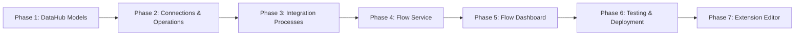
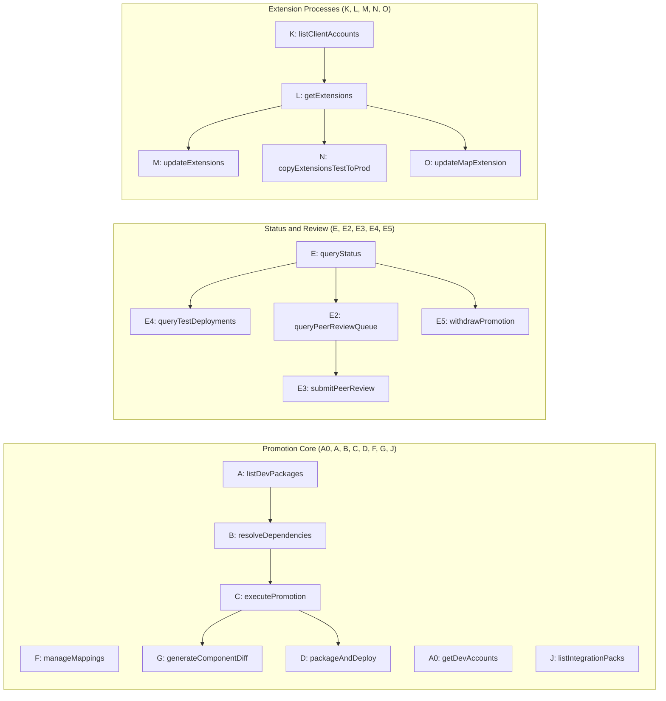

# Boomi Component Promotion System — Build Guide

This guide walks through building every component of the Promotion System step by step. Follow the phases in order — each phase builds on the previous.

## Build Approach

Every build step offers two paths:

1. **Via API** (primary) — `curl` (Linux/macOS) and PowerShell (Windows) commands that create components programmatically through the Boomi Platform API or DataHub Model API. Copy-paste ready with full request payloads.
2. **Via UI (Manual Fallback)** — step-by-step manual instructions using the Boomi AtomSphere UI. Use this if the API path encounters issues or if you prefer visual configuration.

For components with complex internal XML (Integration Processes, Maps), the guide recommends the **API-First Discovery Workflow**: build one component in the UI, export it via `GET /Component/{id}`, then use the XML as a template for batch creation. See [Appendix D: API Automation Guide](22-api-automation-guide.md) for the complete dependency-ordered workflow.

## How to Use This Guide

- **Linear build**: Follow Phases 1-7 sequentially for a first-time build
- **Reference lookup**: Jump to a specific phase/step using the table of contents
- **Validation**: Every major step ends with a "**Verify:**" checkpoint — do not skip these
- **API examples**: All commands are shown in both `curl` (Linux/macOS) and PowerShell (Windows) formats
- **File references**: Templates, profiles, and scripts are in this repository — the guide shows HOW to use them, not duplicates of their content

---

## Prerequisites

- Primary Boomi account with Partner API enabled
- One or more dev sub-accounts (children of the primary account)
- Azure AD/Entra SSO configured in Boomi Flow
- Access to DataHub in your Boomi account
- A public Boomi cloud atom (or ability to provision one)
- **Platform API token** generated at **Settings → Account Information → Platform API Tokens** — used for all `curl`/PowerShell commands in the build guide (format: `BOOMI_TOKEN.user@company.com:api-token`)
- **DataHub Hub Authentication Token** retrieved from **Services → DataHub → Repositories → [your repo] → Configure** tab — required for DataHub Model API calls (Phase 1) and DataHub connection setup (Phase 2)

---

## Bill of Materials

The system comprises **132 components** across 7 phases:

| Phase | Category | Count | Components |
|-------|----------|-------|------------|
| 1 | DataHub Models | 3 | ComponentMapping, DevAccountAccess, PromotionLog (37 fields incl. peer/admin review, branching, multi-environment, withdrawal) |
| 2 | Connections | 2 | HTTP Client (Partner API), DataHub |
| 2 | HTTP Client Operations | 20 | GET/POST/QUERY for Component, Reference, Metadata, PackagedComponent; GET ReleaseIntegrationPackStatus; IntegrationPack (create, query, get); Branch (create, query, get, delete); MergeRequest (create, execute, get); Add To IntegrationPack, ReleaseIntegrationPack |
| 2 | DataHub Operations | 6 | Query + Update for each of 3 models |
| 3 | JSON Profiles | 30 | Request + Response for each of 15 message actions (incl. checkReleaseStatus) |
| 3 | Integration Processes | 14 | A0, A, B, C, D, E, E2, E3, E4, E5, F, G, J, P |
| 4 | FSS Operations | 15 | One per message action |
| 4 | Flow Service | 1 | PROMO - Flow Service |
| 5 | Custom Component | 1 | XmlDiffViewer (React diff viewer for Flow custom player) |
| 5 | Flow Connector | 1 | Promotion Service Connector |
| 5 | Flow Application | 1 | Promotion Dashboard (3 swimlanes, 9 pages) |
| 7 | DataHub Models | 2 | ExtensionAccessMapping, ClientAccountConfig |
| 7 | HTTP Client Operations | 8 | Account, Environment, Extensions CRUD, MapExtension, ComponentReference |
| 7 | DataHub Operations | 4 | Query + Upsert for ExtensionAccessMapping and ClientAccountConfig |
| 7 | JSON Profiles | 12 | Request + Response for 6 new message actions (K-O, Q; incl. ValidateScript pair) |
| 7 | Integration Processes | 6 | K (listClientAccounts), L (getExtensions), M (updateExtensions), N (copyExtensionsTestToProd), O (updateMapExtension), Q (validateScript) |
| 7 | FSS Operations | 6 | One per new message action |
| 7 | Custom Component | 1 | ExtensionEditor (React custom component for env extension editing) |
| | **Total** | **132** | |

---

## Component Naming Convention

All Integration components use the `PROMO - ` prefix followed by a type-specific pattern:

| Type | Pattern | Example |
|------|---------|---------|
| Connection | `PROMO - {Description} Connection` | `PROMO - Partner API Connection` |
| HTTP Operation | `PROMO - HTTP Op - {Method} {Resource}` | `PROMO - HTTP Op - GET Component` |
| DataHub Operation | `PROMO - DH Op - {Action} {Model}` | `PROMO - DH Op - Query ComponentMapping` |
| JSON Profile | `PROMO - Profile - {Action}{Request\|Response}` | `PROMO - Profile - ExecutePromotionRequest` |
| Process | `PROMO - {Description}` | `PROMO - Execute Promotion` |
| FSS Operation | `PROMO - FSS Op - {ActionName}` | `PROMO - FSS Op - ExecutePromotion` |
| Flow Service | `PROMO - Flow Service` | |

DataHub models and Flow components use plain names without the prefix.

---

## Dependency Build Order

### Build Phase Dependencies

Each phase gates the next — complete all steps in a phase before advancing. Phase 7 extends the system after the core (Phases 1–6) is validated end-to-end.

### Process Build Order

Within Phase 3, build Integration processes in dependency order — a process must be built before any process that depends on it. Processes with no dependencies can be built in any order relative to each other.

---

## Repository File Reference

| Directory | Contents | Used In |
|-----------|----------|---------|
| `/datahub/models/` | DataHub model specifications (5 JSON files) | Phase 1, 7 |
| `/datahub/api-requests/` | Test XML for DataHub CRUD validation (5 files) | Phase 1, 6, 7 |
| `/integration/profiles/` | JSON request/response profiles (42 files, 21 message actions × 2) | Phase 3, 7 |
| `/integration/scripts/` | Groovy scripts for XML manipulation (11 files) | Phase 3, 7 |
| `/integration/api-requests/` | API request templates (28 files) | Phase 2, 3, 7 |
| `/integration/flow-service/` | Flow Service component specification | Phase 4 |
| `/flow/` | Flow app structure and page layouts (11 files) | Phase 5, 7 |
| `/docs/` | This guide and architecture reference | All |

---

---
Next: [Phase 1: DataHub Foundation](01-datahub-foundation.md) | [Back to Index](index.md)
