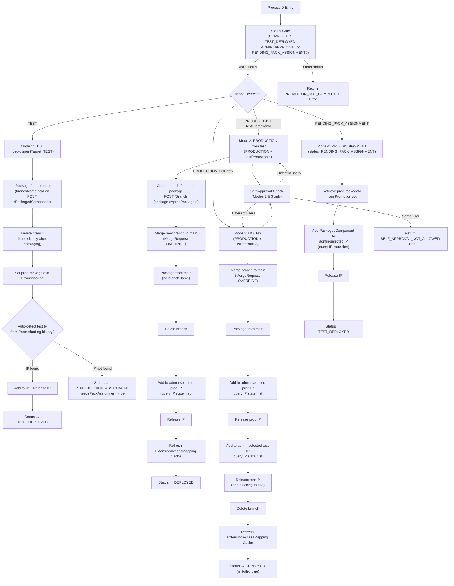

### Process D: Package and Deploy (`PROMO - Package and Deploy`)

> **API Alternative:** This process can be created programmatically via `POST /Component` with `type="process"`. Due to the complexity of process canvas XML (shapes, routing, DPP mappings, script references), the recommended workflow is: (1) build the process manually following the steps below, (2) use `GET /Component/{processId}` to export the XML, (3) store the XML as a template for automated recreation. See [Appendix D: API Automation Guide](22-api-automation-guide.md) for the full workflow.

This process creates a PackagedComponent from a promoted component, adds it to an admin-owned Integration Pack, and releases it. It supports 4 deployment modes: TEST (package from branch, auto-detect IP), PRODUCTION from test (create branch from test package, merge to main, package from main), HOTFIX (merge branch to main, release to prod then test), and PACK_ASSIGNMENT (admin resumes a PENDING_PACK_ASSIGNMENT by adding an existing PackagedComponent to an IP).

**Key design principles:**
- **Main branch protection**: Test deployments do NOT merge to main. The branch is packaged directly using the `branchName` field on POST /PackagedComponent.
- **Admin Integration Pack ownership**: Developers supply no IP fields. IP selection is admin-driven from Page 7.
- **Branch cleanup**: All modes delete the promotion branch (Mode 1 immediately after packaging; Modes 2/3 after release; Mode 4 has no branch — it was deleted in Mode 1).

#### Profiles

| Profile | Source File |
|---------|------------|
| `PROMO - Profile - PackageAndDeployRequest` | `/integration/profiles/packageAndDeploy-request.json` |
| `PROMO - Profile - PackageAndDeployResponse` | `/integration/profiles/packageAndDeploy-response.json` |

The request JSON contains:

**Process-derived (set by upstream steps, not user-supplied):**
- `prodComponentId` (string): the promoted root process component in the primary account
- `branchId` (string): promotion branch ID from Process C
- `promotionId` (string): promotion run ID for PromotionLog updates
- `deploymentTarget` (string): `"TEST"` or `"PRODUCTION"` — determines deployment mode
- `isHotfix` (string): `"true"` / `"false"` — flags emergency production bypass
- `hotfixJustification` (string): required when `isHotfix="true"` (up to 1000 chars)
- `testPromotionId` (string): for production-from-test mode, ID of the originating TEST promotion

**Developer-supplied (from Page 4):**
- `packageVersion` (string): version label for the package (e.g., `"1.2.0"`)
- `deploymentNotes` (string): notes for the PackagedComponent
- `devAccountId` (string): source dev account ID (for audit)
- `devPackageId` (string): source dev package ID (for audit)
- `devPackageCreator` (string): Boomi user who created the dev package
- `devPackageVersion` (string): version of the dev package

**Admin-supplied (from Page 7 — IP assignment fields):**
- `integrationPackId` (string): existing Integration Pack ID to add the component to
- `createNewPack` (boolean): `true` to create a new Integration Pack
- `newPackName` (string): name for new pack (required if `createNewPack = true`)
- `newPackDescription` (string): description for new pack
- `hotfixTestPackId` (string): Test Integration Pack ID for hotfix test release (Mode 3 only)
- `hotfixCreateNewTestPack` (boolean): `true` to create new test pack for hotfix (Mode 3 only)
- `hotfixNewTestPackName` (string): name for new test pack (required if `hotfixCreateNewTestPack=true`)
- `hotfixNewTestPackDescription` (string): description for new test pack

The response JSON contains:
- `success`, `errorCode`, `errorMessage` (standard error contract)
- `packagedComponentId` (string): ID of the created PackagedComponent
- `prodPackageId` (string): same as `packagedComponentId` — stored to PromotionLog for Mode 2 retrieval
- `integrationPackId` (string): ID of the Integration Pack (new or existing)
- `integrationPackName` (string): name of the Integration Pack
- `releaseId` (string): ID from ReleaseIntegrationPack response, for status polling
- `releaseVersion` (string): the released pack version
- `testIntegrationPackId` (string): Test Integration Pack ID (hotfix mode only)
- `testIntegrationPackName` (string): Test Integration Pack name (hotfix mode only)
- `testReleaseId` (string): Test release ID (hotfix mode only)
- `testReleaseVersion` (string): Test release version (hotfix mode only)
- `deploymentTarget` (string): echoes the deployment mode used
- `branchPreserved` (string): always `"false"` — all modes delete the branch
- `isHotfix` (string): `"true"` if this was an emergency hotfix deployment
- `needsPackAssignment` (boolean): `true` when Mode 1 auto-detect found no IP and status is set to `PENDING_PACK_ASSIGNMENT`
- `autoDetectedPackId` (string): the auto-detected Integration Pack ID (for logging), empty if not found

#### FSS Operation

Create `PROMO - FSS Op - PackageAndDeploy` per Section 3.B, using `PROMO - Profile - PackageAndDeployRequest` and `PROMO - Profile - PackageAndDeployResponse`.

#### DPP Initialization

| DPP Name | Initial Value | Purpose |
|----------|--------------|---------|
| `branchId` | (from request) | Promotion branch for packaging (Mode 1) or for merge (Modes 2/3) |
| `branchName` | (from PromotionLog) | Branch name string, used in POST /PackagedComponent `branchName` field (Mode 1) |
| `promotionId` | (from request) | Promotion run ID for PromotionLog updates |
| `adminEmail` | (from request context) | Admin user's email for self-approval check |
| `packagedComponentId` | (set in step 3) | Created PackagedComponent ID |
| `prodPackageId` | (set in step 3) | Same as packagedComponentId — persisted to PromotionLog |
| `deploymentTarget` | (from request) | `"TEST"` or `"PRODUCTION"` |
| `isHotfix` | (from request) | Emergency hotfix flag |
| `hotfixJustification` | (from request) | Hotfix justification text |
| `testPromotionId` | (from request) | Links production promotion to preceding test deployment |
| `integrationPackId` | (from request or auto-detect) | Target Integration Pack ID |
| `mergeRequestId` | (set in step 2.5) | Merge request ID for merge execute and polling |
| `cacheRefreshFailed` | "false" | Tracks whether ExtensionAccessMapping cache refresh succeeded |
| `extensionAccessMappingCount` | "0" | Count of ExtensionAccessMapping records created/updated |
| `hotfixTestPackId` | (from request or step 7.5.1) | Test Integration Pack for hotfix sync |
| `hotfixCreateNewTestPack` | (from request) | Whether to create new test pack |
| `hotfixNewTestPackName` | (from request) | Name for new test pack |
| `hotfixNewTestPackDescription` | (from request) | Description for new test pack |
| `testReleaseId` | (set in step 7.5.3) | Test release ID for status polling |
| `testReleaseFailed` | "false" | Whether test release failed (non-blocking) |

#### Canvas — Shape by Shape

1. **Start shape** — Operation = `PROMO - FSS Op - PackageAndDeploy`

2. **Set Properties — Read Request**
   - DPP `prodComponentId` = document path: `prodComponentId`
   - DPP `branchId` = document path: `branchId`
   - DPP `promotionId` = document path: `promotionId`
   - DPP `packageVersion` = document path: `packageVersion`
   - DPP `integrationPackId` = document path: `integrationPackId`
   - DPP `createNewPack` = document path: `createNewPack`
   - DPP `newPackName` = document path: `newPackName`
   - DPP `newPackDescription` = document path: `newPackDescription`
   - DPP `deploymentTarget` = document path: `deploymentTarget`
   - DPP `isHotfix` = document path: `isHotfix`
   - DPP `hotfixJustification` = document path: `hotfixJustification`
   - DPP `testPromotionId` = document path: `testPromotionId`
   - DPP `hotfixTestPackId` = document path: `hotfixTestPackId`
   - DPP `hotfixCreateNewTestPack` = document path: `hotfixCreateNewTestPack`
   - DPP `hotfixNewTestPackName` = document path: `hotfixNewTestPackName`
   - DPP `hotfixNewTestPackDescription` = document path: `hotfixNewTestPackDescription`

2.0. **Promotion Status Gate**
   - Query PromotionLog from DataHub for the given `promotionId`.
   - Validate that the `status` field is one of:
     - `"COMPLETED"` — promotion succeeded, ready for test packaging (Mode 1)
     - `"TEST_DEPLOYED"` — test deployment succeeded, ready for production promotion (Mode 2)
     - `"ADMIN_APPROVED"` — admin approved, ready for production packaging (Modes 2/3)
     - `"PENDING_PACK_ASSIGNMENT"` — test-packaged but awaiting IP assignment (Mode 4)
   - If the status is anything else (e.g., `"FAILED"`, `"PENDING_PEER_REVIEW"`, `"PENDING_ADMIN_APPROVAL"`), return an error response immediately:
     - `success = false`
     - `errorCode = "PROMOTION_NOT_COMPLETED"`
     - `errorMessage = "Promotion {promotionId} has status '{status}' — packaging requires COMPLETED, TEST_DEPLOYED, ADMIN_APPROVED, or PENDING_PACK_ASSIGNMENT status"`
   - **Why this gate exists**: Process D merges the promotion branch to main (Modes 2/3). Without this gate, a direct API call to the Flow Service could bypass the UI and merge a partially-promoted or unapproved branch. This is a defense-in-depth measure.

2.1. **Decision — Mode Detection**
   - Examine PromotionLog `status` and request fields to determine the deployment mode:
     - **Mode 4** — `status = "PENDING_PACK_ASSIGNMENT"` → jump to step M4.1
     - **Mode 1** — `deploymentTarget = "TEST"` → proceed to step 2.2
     - **Mode 2** — `deploymentTarget = "PRODUCTION"` AND `testPromotionId` non-empty → proceed to step 2.3
     - **Mode 3** — `deploymentTarget = "PRODUCTION"` AND `isHotfix = "true"` → proceed to step 2.4

2.2. **Admin Self-Approval Prevention (Modes 2 and 3 only)**
   - For production modes, validate that the admin submitting the deployment did not initiate the original promotion.
   - Query PromotionLog for the `promotionId` to retrieve the `initiatedBy` field.
   - Compare: `adminEmail.toLowerCase() != initiatedBy.toLowerCase()`.
   - If the same person: return error with `errorCode = "SELF_APPROVAL_NOT_ALLOWED"`, `errorMessage = "Admin cannot approve and deploy their own promotion"`. Do not proceed.
   - This is a backend enforcement in addition to the UI-level Decision step on Page 7.
   - **Note**: Mode 1 (TEST) is developer-driven. Mode 4 (PACK_ASSIGNMENT) is admin IP assignment, not promotion approval. Neither requires this check.

---

### Deployment Mode Decision Tree

Process D supports four deployment modes. The mode determines which pipeline steps are executed and the resulting promotion status.

---

### Mode 1 — TEST

**Goal**: Package the promoted component for test environment validation without touching main.

**Step M1.1 — HTTP Client Send — POST PackagedComponent (from branch)**
   - Connector: `PROMO - Partner API Connection`
   - Operation: `PROMO - HTTP Op - POST PackagedComponent`
   - URL parameter `{1}` = DPP `primaryAccountId`
   - Request body: `componentId` = DPP `prodComponentId`, `packageVersion` = DPP `packageVersion`, `branchName` = DPP `branchName`, `notes` = promotion metadata, `shareable` = `true`
   - The `branchName` field causes Boomi to package from the branch snapshot — main is NOT modified
   - Response returns the new `packagedComponentId`; extract into DPP `packagedComponentId` and `prodPackageId`

**Step M1.2 — HTTP Client Send — DELETE Branch (immediately)**
   - Connector: `PROMO - Partner API Connection`
   - Operation: `PROMO - HTTP Op - DELETE Branch`
   - URL parameter `{1}` = DPP `primaryAccountId`, `{2}` = DPP `branchId`
   - Delete the branch immediately after packaging — the branch content has been captured in the PackagedComponent
   - Idempotent: both `200` (deleted) and `404` (already deleted) are success
   - **Branch is freed here**, before IP operations — frees the branch slot early regardless of IP outcome

**Step M1.3 — DataHub Update — Set prodPackageId in PromotionLog**
   - Update PromotionLog record for `promotionId`: set `prodPackageId` = DPP `prodPackageId`
   - This persists the package reference for Mode 2 retrieval

**Step M1.4 — Auto-Detect Test Integration Pack**
   - Query PromotionLog DataHub for records matching:
     - `processName = {processName from current PromotionLog}`
     - `targetEnvironment = "TEST"`
     - `status = "TEST_DEPLOYED"`
     - Has non-empty `integrationPackId`
   - Sort by `testDeployedAt` descending; take the most recent match
   - If a matching record is found: set DPP `integrationPackId` to the matched record's `integrationPackId`
   - If no matching record is found: proceed to PENDING_PACK_ASSIGNMENT path

**Step M1.5 — Decision — IP Found?**
   - **YES (IP found):**
     - Query IP state: GET /IntegrationPack/{integrationPackId} (see Multi-Package Release Safety below)
     - Add PackagedComponent to IP: `PROMO - HTTP Op - POST Add To IntegrationPack` with `{2}` = DPP `integrationPackId`, `{3}` = DPP `packagedComponentId`
     - Release IP: `PROMO - HTTP Op - POST ReleaseIntegrationPack`
     - Extract `releaseId` from response; store in DPP `releaseId`
     - Update PromotionLog: `status = "TEST_DEPLOYED"`, `testDeployedAt = now`, `integrationPackId` = DPP `integrationPackId`
     - Response: `needsPackAssignment = false`, `autoDetectedPackId = integrationPackId`
   - **NO (IP not found):**
     - Update PromotionLog: `status = "PENDING_PACK_ASSIGNMENT"`
     - Response: `needsPackAssignment = true`, `autoDetectedPackId = ""`
     - Return success response — no error; admin will assign the IP via Mode 4

---

### Mode 2 — PRODUCTION from Test

**Goal**: Promote a test-validated component to production. Main is touched for the first time here.

**Step M2.1 — Retrieve Test Package Reference**
   - Query PromotionLog for `testPromotionId` to retrieve `prodPackageId` (the PackagedComponent created in Mode 1)
   - Store in DPP `testProdPackageId`

**Step M2.2 — HTTP Client Send — POST Branch (from test package)**
   - Connector: `PROMO - Partner API Connection`
   - Operation: `PROMO - HTTP Op - POST Branch`
   - URL parameter `{1}` = DPP `primaryAccountId`
   - Request body: `name` = `"promo-prod-{promotionId}"`, `packageId` = DPP `testProdPackageId`
   - Creating a branch from a PackagedComponent restores that component snapshot to a new branch
   - Extract new `branchId` from response; store in DPP `branchId`

**Step M2.3 — HTTP Client Send — POST MergeRequest (Create)**
   - Connector: `PROMO - Partner API Connection`
   - Operation: `PROMO - HTTP Op - POST MergeRequest`
   - URL parameter `{1}` = DPP `primaryAccountId`
   - Request body: `source` = DPP `branchId`, `strategy` = `"OVERRIDE"`, `priorityBranch` = DPP `branchId`
   - OVERRIDE strategy — the branch from the test package wins without conflict resolution
   - Extract `mergeRequestId` from response; store in DPP `mergeRequestId`

**Step M2.4 — HTTP Client Send — POST MergeRequest Execute + Poll**
   - Execute: `PROMO - HTTP Op - POST MergeRequest Execute` with `action = "MERGE"`
   - Poll: `PROMO - HTTP Op - GET MergeRequest` until `stage = MERGED` (max 12 attempts, 5s interval)
   - On `MERGE_FAILED`: error with `errorCode = "MERGE_FAILED"`, attempt DELETE branch
   - On timeout: error with `errorCode = "MERGE_TIMEOUT"`
   - **This is the first and only time main is modified for this promotion**

**Step M2.5 — HTTP Client Send — POST PackagedComponent (from main)**
   - Standard package from main (no `branchName` field)
   - Request body: `componentId` = DPP `prodComponentId`, `packageVersion` = DPP `packageVersion`, `notes` = metadata, `shareable` = `true`
   - Extract `packagedComponentId` into DPP

**Step M2.6 — HTTP Client Send — DELETE Branch**
   - Delete the temporary production branch created in M2.2
   - Idempotent: both `200` and `404` are success

**Step M2.7 — Multi-Package Safety Query + Add to IP + Release**
   - Query IP state: GET /IntegrationPack/{integrationPackId} (admin-supplied from request)
   - Build release list including ALL current component versions (see Multi-Package Release Safety below)
   - Add PackagedComponent to IP: POST Add To IntegrationPack
   - Release IP: POST ReleaseIntegrationPack
   - Extract `releaseId` from response

**Step M2.8 — ExtensionAccessMapping Cache Refresh**
   - See Cache Refresh section below

**Step M2.9 — Update PromotionLog**
   - `status = "DEPLOYED"`, `deployedAt = now`, `integrationPackId`, `releaseId`, `prodPackageId`

---

### Mode 3 — HOTFIX

**Goal**: Emergency production fix. Merges branch to main, releases to prod then test.

**Step M3.1 — HTTP Client Send — POST MergeRequest (Create)**
   - Same as old step 2.5: `source` = DPP `branchId`, `strategy` = `"OVERRIDE"`
   - Extract `mergeRequestId`

**Step M3.2 — HTTP Client Send — POST MergeRequest Execute + Poll**
   - Execute and poll until `stage = MERGED`
   - On failure: error with `MERGE_FAILED`, attempt DELETE branch

**Step M3.3 — HTTP Client Send — POST PackagedComponent (from main)**
   - Standard package from main (no `branchName` field)
   - Extract `packagedComponentId`

**Step M3.4 — Multi-Package Safety Query + Add to Prod IP + Release Prod**
   - Query prod IP state: GET /IntegrationPack/{integrationPackId}
   - Add PackagedComponent to prod IP
   - Release prod IP; extract `releaseId`

**Step M3.5 — Hotfix Test Release (Non-Blocking)**

   **M3.5.1 — Decision — Create/Use Test Pack**
   - Condition: DPP `hotfixCreateNewTestPack` **EQUALS** `"true"`
   - **YES** branch: POST IntegrationPack with `hotfixNewTestPackName` / `hotfixNewTestPackDescription`; store result in DPP `hotfixTestPackId`
   - **NO** branch: Use existing `hotfixTestPackId` from request

   **M3.5.2 — Multi-Package Safety Query + Add to Test IP**
   - Query test IP state: GET /IntegrationPack/{hotfixTestPackId}
   - Add PackagedComponent to test IP

   **M3.5.3 — Release Test Integration Pack**
   - POST ReleaseIntegrationPack with `integrationPackId` = DPP `hotfixTestPackId`
   - Extract `testReleaseId`; store in DPP `testReleaseId`

   **Error Handling:** Test release failure is **NON-BLOCKING**. Production release already succeeded. Log the error, set DPP `testReleaseFailed` = `"true"`, and continue to branch deletion.

**Step M3.6 — HTTP Client Send — DELETE Branch**
   - Delete branch after BOTH prod and test releases are attempted
   - Idempotent: both `200` and `404` are success

**Step M3.7 — ExtensionAccessMapping Cache Refresh**
   - See Cache Refresh section below

**Step M3.8 — Update PromotionLog**
   - `status = "DEPLOYED"`, `isHotfix = "true"`, `hotfixJustification`, `deployedAt = now`, `integrationPackId`, `releaseId`, `testIntegrationPackId`, `testReleaseId`

---

### Mode 4 — PACK_ASSIGNMENT

**Goal**: Admin assigns an Integration Pack to a component that was packaged in Mode 1 but found no IP.

**Note**: No branch operations occur in Mode 4 — the branch was already deleted in Mode 1 step M1.2. No self-approval check — this is IP assignment, not promotion approval.

**Step M4.1 — Retrieve Existing PackagedComponent Reference**
   - Query PromotionLog for `promotionId` to retrieve `prodPackageId`
   - Store in DPP `packagedComponentId`

**Step M4.2 — Multi-Package Safety Query + Add to Admin-Selected IP + Release**
   - Query IP state: GET /IntegrationPack/{integrationPackId} (admin-supplied from request)
   - Build release list (see Multi-Package Release Safety)
   - Add PackagedComponent: POST Add To IntegrationPack with `{2}` = DPP `integrationPackId`, `{3}` = DPP `packagedComponentId`
   - Release IP: POST ReleaseIntegrationPack
   - Extract `releaseId`

**Step M4.3 — Update PromotionLog**
   - `status = "TEST_DEPLOYED"`, `integrationPackId`, `testDeployedAt = now`, `releaseId`
   - The PackagedComponent was created for test in Mode 1 → status becomes TEST_DEPLOYED

---

### Multi-Package Release Safety

Applies to **all modes** that perform IP release operations. Before releasing an Integration Pack, query its current state to avoid accidentally excluding other components from the release.

**Why this matters**: The ReleaseIntegrationPack API requires an explicit list of all `ReleasePackagedComponents`. Any component omitted from the list is excluded from the released version. If multiple processes are in the same Integration Pack, omitting them would de-publish them.

**Procedure** (add before each Release IP step):

1. **GET /IntegrationPack/{integrationPackId}** — returns the current list of `packagedComponents` with their current `version` values
2. **Build `ReleasePackagedComponents` list**: include ALL entries from the GET response
3. **Update only the target component's version** to the newly created `packagedComponentId`
4. **POST ReleaseIntegrationPack** with the explicit `ReleasePackagedComponents` list

This ensures other components in the pack retain their current release versions.

---

### ExtensionAccessMapping Cache Refresh

Applies to **Modes 2 and 3** only. Test environment (Mode 1) and IP assignment (Mode 4) do not require cache refresh.

After successful release to Production:

1. **HTTP Client Send — GET EnvironmentExtensions**
   - Connector: `PROMO - Partner API Connection`
   - Operation: `PROMO - HTTP Op - GET EnvironmentExtensions`
   - Query: `environmentId = {targetEnvironmentId}` (from release context)
   - Response: Full EnvironmentExtensions object with all extension components

2. **DataHub Query — ComponentMapping Lookup**
   - For each component found in the EnvironmentExtensions response:
     - Query ComponentMapping: `prodComponentId = {componentId}` to find originating `devAccountId`(s)

3. **DataHub Query — DevAccountAccess Lookup**
   - For each unique `devAccountId` found:
     - Query DevAccountAccess: `devAccountId = {devAccountId}` AND `isActive = "true"`
     - Collect authorized SSO group IDs

4. **Groovy Script — Build Extension Access Cache**
   - Script: `build-extension-access-cache.groovy` (from `/integration/scripts/`)
   - Input: Combined JSON with extensions, componentMappings, and devAccountAccessRecords
   - Output: Array of ExtensionAccessMapping records

5. **DataHub Upsert — Store ExtensionAccessMapping Records**
   - Operation: `PROMO - DH Op - Upsert ExtensionAccessMapping`
   - Upsert each record (match on `environmentId` + `prodComponentId`)

**Error Handling:** Cache refresh failures MUST NOT fail the overall release. If it fails:
- Log: `logger.warning("ExtensionAccessMapping cache refresh failed for environment {environmentId}: {error}")`
- Set DPP `cacheRefreshFailed` = `"true"`
- Continue to next step — the release succeeded

---

### Steps 9–10: Build Response and Return

9. **Map — Build Response JSON**
   - Source: accumulated results and DPPs
   - Destination: `PROMO - Profile - PackageAndDeployResponse`
   - Map:
     - `packagedComponentId` from DPP `packagedComponentId`
     - `prodPackageId` from DPP `prodPackageId`
     - `integrationPackId` from DPP `integrationPackId`
     - `integrationPackName` = DPP `newPackName` (or queried name for existing pack)
     - `releaseId` from DPP `releaseId`
     - `releaseVersion` from Release IP response
     - `deploymentTarget` = DPP `deploymentTarget`
     - `branchPreserved` = `"false"` (all modes delete branch)
     - `isHotfix` = DPP `isHotfix`
     - `needsPackAssignment` = `true` only if Mode 1 auto-detect failed
     - `autoDetectedPackId` = detected IP ID or empty string
     - `success` = `true`

10. **Return Documents** — same as Process F

#### Error Handling

Wrap the entire process (steps 2.0–9) in a **Try/Catch**:
- **Promotion status gate failure** (step 2.0): return error immediately with `errorCode = "PROMOTION_NOT_COMPLETED"` — PromotionLog status is not one of the accepted values. This gate prevents merging incomplete branches to main.
- **Merge failure** (M2.4 / M3.2): attempt `DELETE /Branch/{branchId}`, return error with `errorCode = "MERGE_FAILED"`
- **PackagedComponent creation failure**: attempt `DELETE /Branch/{branchId}` (Modes 2/3 only — Mode 1 already deleted it), return error with `errorCode = "PROMOTION_FAILED"`
- **Integration Pack failure**: attempt `DELETE /Branch/{branchId}` (Modes 2/3 only), return error with `errorCode = "PROMOTION_FAILED"`
- **Branch errors in Mode 1**: branch is already deleted before IP operations. If branch DELETE in M1.2 fails, log and continue — the PackagedComponent is already created.
- **Catch block**: In all catastrophic failure cases, attempt `DELETE /Branch/{branchId}` (if applicable) before returning the error response. Log delete failures but do not mask the original error.

#### Branch Deletion on Rejection/Denial

Promotion branches must be cleaned up not only on successful deployment but also when a promotion is rejected or denied. Without cleanup, rejected promotions leave orphaned branches that count against the platform branch limit (15 operational threshold, 20 hard limit).

**Peer Rejection Path (Process E3 records PEER_REJECTED):**

When Process E3 records a `PEER_REJECTED` decision:
1. After updating the PromotionLog with `peerReviewStatus = "PEER_REJECTED"`, retrieve the `branchId` from the PromotionLog record.
2. Call `DELETE /Branch/{branchId}` using `PROMO - HTTP Op - DELETE Branch` with URL parameter `{1}` = DPP `primaryAccountId`, `{2}` = the promotion's `branchId`.
3. Handle responses: `200` = deleted successfully, `404` = branch already deleted (both are success).
4. Update PromotionLog: set `branchId` = `null` to reflect that the branch no longer exists.
5. Log delete failures but do not fail the peer review response — the review decision has already been recorded.

**Admin Denial Path (Page 7 denial):**

When an admin denies the deployment at Page 7:
1. Before marking the promotion as `ADMIN_REJECTED`, retrieve the `branchId` from the PromotionLog record.
2. Call `DELETE /Branch/{branchId}` using `PROMO - HTTP Op - DELETE Branch` with URL parameter `{1}` = DPP `primaryAccountId`, `{2}` = the promotion's `branchId`.
3. Handle responses: `200` = deleted successfully, `404` = branch already deleted (both are success).
4. Update PromotionLog: set `status = "ADMIN_REJECTED"`, `branchId` = `null`, `adminComments` = denial reason.
5. Log delete failures but do not fail the denial response — the rejection decision takes priority.

---

**Verify — 4 deployment modes:**

**Mode 1 — Test deployment (auto-detect IP found):**
- Promote a component (Process C), then send a Package and Deploy request with `deploymentTarget = "TEST"`
- **Expected**: `success = true`, `branchPreserved = "false"`, `needsPackAssignment = false`, `autoDetectedPackId` populated, `releaseId` populated
- **Expected PromotionLog**: `status = "TEST_DEPLOYED"`, `testDeployedAt` populated, `integrationPackId` populated, `branchId` null (branch deleted)

**Mode 1 — Test deployment (no prior IP history):**
- Promote a brand-new process (Process C), then send a Package and Deploy request with `deploymentTarget = "TEST"`
- **Expected**: `success = true`, `branchPreserved = "false"`, `needsPackAssignment = true`, `releaseId` empty, `autoDetectedPackId` empty
- **Expected PromotionLog**: `status = "PENDING_PACK_ASSIGNMENT"`, `prodPackageId` populated, `branchId` null

**Mode 2 — Production from test:**
- Using the test deployment from Mode 1, send a Package and Deploy request with `deploymentTarget = "PRODUCTION"`, `testPromotionId = "{testPromotionId}"`, admin-supplied `integrationPackId`
- **Expected**: `success = true`, `branchPreserved = "false"`, `releaseId` populated, temp branch created and deleted
- **Expected PromotionLog**: `status = "DEPLOYED"`, `testPromotionId` links back to test record, `deployedAt` populated

**Mode 3 — Hotfix:**
- Promote a component (Process C), then send a Package and Deploy request with `deploymentTarget = "PRODUCTION"`, `isHotfix = "true"`, `hotfixJustification = "Critical API fix"`, admin-supplied `integrationPackId` and `hotfixTestPackId` (or `hotfixCreateNewTestPack = true`)
- **Expected**: `success = true`, `isHotfix = "true"`, `branchPreserved = "false"`, `testIntegrationPackId` populated, `testReleaseId` populated
- **Expected PromotionLog**: `status = "DEPLOYED"`, `isHotfix = "true"`, `hotfixJustification` populated, `testIntegrationPackId`/`testReleaseId` populated

**Mode 4 — Pack assignment:**
- Starting from a promotion with `status = "PENDING_PACK_ASSIGNMENT"`, send a Package and Deploy request with admin-supplied `integrationPackId`
- **Expected**: `success = true`, `releaseId` populated, `needsPackAssignment = false`
- **Expected PromotionLog**: `status = "TEST_DEPLOYED"`, `integrationPackId` populated, `testDeployedAt` updated

---

---
Prev: [Process C: Execute Promotion](10-process-c-execute-promotion.md) | Next: [Process J: List Integration Packs](12-process-j-list-integration-packs.md) | [Back to Index](index.md)
