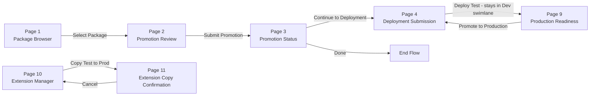

## Phase 5: Flow Dashboard

### Step 5.1 -- Install Connector

1. In Boomi Flow, navigate to **Services -> Connectors -> New Connector**.
2. Select connector type: **Boomi Integration Service**.
3. Configure the connection:
   - **Runtime Type**: Public Cloud
   - **Path to Service**: `/fs/PromotionService`
   - **Authentication**: Basic
     - **Username**: the shared web server user (from **Shared Web Server User Management** in AtomSphere)
     - **Password**: the API token for that user
4. Click **"Retrieve Connector Configuration Data"**. Flow contacts the deployed Flow Service and auto-discovers all 20 message actions. Wait for the operation to complete.
5. Verify the auto-generated Flow Types. You should see exactly 40 types (one request and one response for each action):
   1. `getDevAccounts REQUEST - getDevAccountsRequest`
   2. `getDevAccounts RESPONSE - getDevAccountsResponse`
   3. `listDevPackages REQUEST - listDevPackagesRequest`
   4. `listDevPackages RESPONSE - listDevPackagesResponse`
   5. `resolveDependencies REQUEST - resolveDependenciesRequest`
   6. `resolveDependencies RESPONSE - resolveDependenciesResponse`
   7. `executePromotion REQUEST - executePromotionRequest`
   8. `executePromotion RESPONSE - executePromotionResponse`
   9. `packageAndDeploy REQUEST - packageAndDeployRequest`
   10. `packageAndDeploy RESPONSE - packageAndDeployResponse`
   11. `queryStatus REQUEST - queryStatusRequest`
   12. `queryStatus RESPONSE - queryStatusResponse`
   13. `manageMappings REQUEST - manageMappingsRequest`
   14. `manageMappings RESPONSE - manageMappingsResponse`
   15. `queryPeerReviewQueue REQUEST - queryPeerReviewQueueRequest`
   16. `queryPeerReviewQueue RESPONSE - queryPeerReviewQueueResponse`
   17. `submitPeerReview REQUEST - submitPeerReviewRequest`
   18. `submitPeerReview RESPONSE - submitPeerReviewResponse`
   19. `listIntegrationPacks REQUEST - listIntegrationPacksRequest`
   20. `listIntegrationPacks RESPONSE - listIntegrationPacksResponse`
   21. `generateComponentDiff REQUEST - generateComponentDiffRequest`
   22. `generateComponentDiff RESPONSE - generateComponentDiffResponse`
   23. `queryTestDeployments REQUEST - queryTestDeploymentsRequest`
   24. `queryTestDeployments RESPONSE - queryTestDeploymentsResponse`
   25. `cancelTestDeployment REQUEST - cancelTestDeploymentRequest`
   26. `cancelTestDeployment RESPONSE - cancelTestDeploymentResponse`
   27. `withdrawPromotion REQUEST - withdrawPromotionRequest`
   28. `withdrawPromotion RESPONSE - withdrawPromotionResponse`
   29. `listClientAccounts REQUEST - listClientAccountsRequest`
   30. `listClientAccounts RESPONSE - listClientAccountsResponse`
   31. `getExtensions REQUEST - getExtensionsRequest`
   32. `getExtensions RESPONSE - getExtensionsResponse`
   33. `updateExtensions REQUEST - updateExtensionsRequest`
   34. `updateExtensions RESPONSE - updateExtensionsResponse`
   35. `copyExtensionsTestToProd REQUEST - copyExtensionsTestToProdRequest`
   36. `copyExtensionsTestToProd RESPONSE - copyExtensionsTestToProdResponse`
   37. `updateMapExtension REQUEST - updateMapExtensionRequest`
   38. `updateMapExtension RESPONSE - updateMapExtensionResponse`
   39. `checkReleaseStatus REQUEST - checkReleaseStatusRequest`
   40. `checkReleaseStatus RESPONSE - checkReleaseStatusResponse`
6. Open the **Configuration Values** section of the connector. Set `primaryAccountId` to your primary Boomi account ID.
7. Click **Install**, then **Save**.

**Verify:** Open the connector and confirm all 40 types appear under **Types**. If any are missing, click "Retrieve Connector Configuration Data" again and check that the Flow Service is deployed and all 20 listeners are running.

### Step 5.2 -- Create Flow Application

1. Navigate to **Flow -> Build -> New Flow**.
2. Name: `Promotion Dashboard`.
3. Add **Developer Swimlane**:
   - Authorization: SSO group `ABC_BOOMI_FLOW_CONTRIBUTOR`
   - This swimlane is the entry point for the application
4. Add **Peer Review Swimlane**:
   - Authorization: SSO groups `ABC_BOOMI_FLOW_CONTRIBUTOR` OR `ABC_BOOMI_FLOW_ADMIN` (any listed group grants access)
   - This swimlane receives control after the developer submits for peer review
   - Note: Boomi Flow supports multiple SSO groups per swimlane with OR logic
5. Add **Admin Swimlane**:
   - Authorization: SSO group `ABC_BOOMI_FLOW_ADMIN`
   - This swimlane receives control after peer review passes

Build the 11 pages in order. Each page uses Message steps to call Flow Service actions and Decision steps to handle the `success` field in responses.

#### Page 1: Package Browser (Developer Swimlane)

Reference: `/flow/page-layouts/page1-package-browser.md` for full UI specification.

This is the developer entry point. Users select a dev account and browse available packages.

**Page load -- Message step configuration:**

1. Add a **Message** step on the page load event.
   - **Action**: `getDevAccounts`
   - **Connector**: `Promotion Service Connector`
   - **Input values**: Bind `userSsoGroups` from the SSO authorization context (the user's Azure AD group memberships)
   - **Output values**: Bind response to `accessibleAccounts` Flow value (list of dev accounts with `devAccountId` and `devAccountName` fields)
2. Add a **Decision** step immediately after the Message step.
   - **Condition**: `{getDevAccountsResponse.success} == true`
   - **True path**: Continue to render page UI
   - **False path**: Navigate to Error Page with `{getDevAccountsResponse.errorMessage}`

**UI components:**

3. Add an **Account Selector** combobox:
   - Data source: `accessibleAccounts`
   - Display field: `devAccountName`
   - Value field: `devAccountId`
   - On change: Store selected value in `selectedDevAccountId` and `selectedDevAccountName` Flow values, then trigger a second Message step
4. Add the on-change **Message** step for the combobox:
   - **Action**: `listDevPackages`
   - **Input values**: `selectedDevAccountId`
   - **Output values**: `packages` (array of package objects)
   - **Decision**: Check `{listDevPackagesResponse.success} == true`; on failure, show error
5. Add a **Packages Data Grid** bound to the `packages` output. Columns: Package Name, Version, Type, Created (default sort descending), Notes.
6. On row select: Store the entire row object in `selectedPackage` Flow value (contains `componentId`, `packageId`, `componentName`, `packageVersion`).
7. Add a **"Review for Promotion"** button:
   - Enabled when `selectedPackage` is not null
   - On click: Navigate to Page 2

**Flow values set on this page:** `selectedDevAccountId`, `selectedDevAccountName`, `selectedPackage`, `accessibleAccounts`.

#### Page 2: Promotion Review (Developer Swimlane)

Reference: `/flow/page-layouts/page2-promotion-review.md` for full UI specification.

Displays the resolved dependency tree and allows the developer to execute promotion.

**Page load:**

1. Message step: action = `resolveDependencies`, inputs = `selectedPackage.componentId` + `selectedDevAccountId`, outputs = `dependencyTree` (list), `totalComponents`, `newCount`, `updateCount`, `envConfigCount`.
2. Decision step: check `{resolveDependenciesResponse.success} == true`. Failure path goes to Error Page.

**UI components:**

3. **Summary labels**: Root Process name, Total Components count, badges for "X to create", "Y to update", "Z with credentials to reconfigure" (conditional on `envConfigCount > 0`).
4. **Dependency Tree Data Grid** bound to `dependencyTree`. Columns: Component Name (bold for root), Type (badge), Dev Version, Prod Status (NEW/UPDATE badge), Prod Component ID (truncated GUID), Prod Version, Env Config (warning icon). Grid is pre-sorted by dependency order (profiles first, root process last) and not user-sortable.
5. **"Promote to Primary Account"** button:
   - On click: Show confirmation modal summarizing counts
   - On confirm: Message step with action = `executePromotion`, inputs = `selectedPackage.componentId` + `selectedDevAccountId` + `dependencyTree`, outputs = `promotionId`, `promotionResults`, `componentsCreated`, `componentsUpdated`, `componentsFailed`
   - Decision step: check success. On true: navigate to Page 3. On false: navigate to Error Page
   - The Flow Service handles async wait responses automatically; the user sees a spinner during execution
6. **"Cancel"** button: Navigate back to Page 1.

#### Page 3: Promotion Status (Developer Swimlane)

Reference: `/flow/page-layouts/page3-promotion-status.md` for full UI specification.

Displays results after `executePromotion` completes. The Flow Service returns wait responses during long-running promotion; the user sees a spinner and can safely close the browser.

**UI components (after completion):**

1. **Summary section**: Promotion ID (copyable), badges for Created/Updated/Failed counts.
2. **Results Data Grid** bound to `promotionResults`. Columns: Component Name, Action (CREATE/UPDATE badge), Status (SUCCESS/FAILED badge), Prod Component ID, Prod Version, Config Stripped (warning icon if true), Error message (red text, truncated with tooltip).
3. **Credential Warning box** (conditional): Shown when any component has `configStripped = true`. Lists affected component names and instructions for reconfiguration in the primary account Build tab.
4. **Deployment Target Selection** (radio button group):
   - **"Deploy to Test"** (default, selected by default): Standard path — deploy to test environment first, review later for production
   - **"Deploy to Production (Emergency Hotfix)"**: Shows warning banner + required justification textarea
     - Warning text: "This will bypass test deployment and submit directly for production review. Use only for critical fixes."
     - `hotfixJustification` textarea (required when selected, max 1000 characters)
   - On change: Set Flow values `targetEnvironment` (`"TEST"` or `"PRODUCTION"`), `isHotfix` (`"false"` or `"true"`), `hotfixJustification` (text or empty)
5. **"Continue to Deployment"** button:
   - Enabled only when `componentsFailed == 0` and (if hotfix selected, `hotfixJustification` is non-empty)
   - On click: Navigate to Page 4 with deployment target context
6. **"Done"** button: End flow.

#### Page 4: Deployment Submission (Developer to Peer Review Transition)

Reference: `/flow/page-layouts/page4-deployment-submission.md` for full UI specification.

The developer fills out deployment details and submits for peer review or triggers a direct test deployment. This page marks the transition between the Developer and Peer Review swimlanes for production paths. For test deployments it stays in the Developer swimlane.

**Mode detection on page load:**

On page load, detect the deployment mode from Flow values:
- **Mode 1 — Test** (`targetEnvironment = "TEST"`, `testPromotionId` empty): Direct test deployment with automated validation, no manual approval gates. `packageAndDeploy` auto-detects the Integration Pack from the branch.
- **Mode 2 — Production from Test** (`targetEnvironment = "PRODUCTION"`, `testPromotionId` non-empty): Production deployment of a previously tested package. IP selection happens on Page 7 (Admin Approval Queue) during the admin review step.
- **Mode 3 — Hotfix** (`targetEnvironment = "PRODUCTION"`, `isHotfix = "true"`): Emergency production deployment. IP selection also handled on Page 7.
- **Mode 4 — Admin-assigned IP** (`targetEnvironment = "PRODUCTION"`, `integrationPackId` provided by admin on Page 7): Admin has already chosen the IP; this mode submits with the pre-assigned pack.

**Shared form components (all modes):**

1. **Package Version** text input: Pre-populated from `selectedPackage.packageVersion`. Required.
2. **Deployment Notes** textarea: Optional, max 500 characters.

**Mode 1 — Test deployment behavior:**

3a. **Test Summary Panel**: Header reads "Deploy to Test Environment". Brief instructions: "Components will be deployed to the test environment for automated validation. The promotion branch is preserved for future production review."
3b. **"Deploy to Test"** button (primary):
   - Validates all required fields
   - Calls `packageAndDeploy` directly with `deploymentTarget = "TEST"` — process auto-detects the Integration Pack
   - Shows inline deployment results (no swimlane transition)
   - On success: Sends test deployment email to submitter, shows results with link to Page 9 (Production Readiness)
   - Stays in Developer swimlane — automated validation only, no manual approval gates for test deployments

**Mode 2 — Production from test behavior:**

3c. **Test Deployment Summary Panel**: Shows test deployment details (test date, branch info, component counts) from the preceding test deployment
3d. **"Submit for Production Deployment"** button (primary):
   - Validates all required fields
   - Builds deployment request with `deploymentTarget = "PRODUCTION"`, `testPromotionId`, `testIntegrationPackId`, `testIntegrationPackName`
   - Sends email notification for peer review (subject: "Peer Review Needed: {processName} v{packageVersion}")
   - Transitions to Peer Review swimlane
   - Developer sees confirmation message with Promotion ID

**Mode 3 — Hotfix behavior:**

3e. **Hotfix Warning Panel**: Prominent warning banner with hotfix justification displayed. Header: "Emergency Hotfix — Production Deployment"
3f. **"Submit Hotfix for Peer Review"** button (warning/amber):
   - Validates all required fields
   - Builds deployment request with `deploymentTarget = "PRODUCTION"`, `isHotfix = "true"`, `hotfixJustification`
   - Sends emergency hotfix email notification (subject includes "EMERGENCY HOTFIX")
   - Transitions to Peer Review swimlane
   - Developer sees confirmation message with Promotion ID

4. **"Cancel"** button: Navigate back to Page 3 (or Page 9 if coming from production readiness).

#### Page 9: Production Readiness Queue (Developer Swimlane)

Reference: `/flow/page-layouts/page9-production-readiness.md` for full UI specification.

Displays test deployments that are ready to be promoted to production. Developers return here after validating in the test environment.

**Page load:**

1. Message step: action = `queryTestDeployments`, inputs = `devAccountId` (optional filter), `initiatedBy` (optional filter), outputs = `testDeployments` array.
2. Decision step: check `{queryTestDeploymentsResponse.success} == true`. Failure path goes to Error Page.

**UI components:**

3. **Production Readiness Data Grid** bound to `testDeployments`. Columns: Process Name (bold), Package Version, Test Deployed (date + relative age), Branch Age (color coded: green 0-14 days, amber 15-30 days, red >30 days), Components, Created/Updated counts, Test Pack name, Submitted By. Default sort: `testDeployedAt` descending.
4. **Stale Branch Warning** (conditional): Shown when any deployment has branch age >30 days. Amber banner: "{count} deployment(s) have been in test for over 30 days. Consider promoting to production or canceling."
5. On row select: Store selected deployment in `selectedTestDeployment` Flow value. Expand **Test Deployment Detail Panel** below the grid showing promotion details, test deployment info (date, pack, branch status), and component summary.
6. **"Promote to Production"** button (green, enabled when a row is selected):
   - Sets Flow values: `testPromotionId`, `targetEnvironment = "PRODUCTION"`, `isHotfix = "false"`, `branchId`, `branchName`, `testIntegrationPackId`, `testIntegrationPackName`
   - Carries forward: `promotionId`, `processName`, `packageVersion`, component counts
   - Navigates to Page 4 (pre-filled for production-from-test mode)
7. **"Refresh"** button: Re-executes `queryTestDeployments` to update the grid.

### Step 5.4 -- Wire Navigation

#### Developer Page Navigation Flow

The developer swimlane pages follow a linear promotion workflow, with extension management as a parallel track.

Connect all pages via Outcome elements on the Flow canvas.

1. **Flow start** -> Page 1 (Package Browser) in the Developer swimlane.
2. **Page 1** "Review for Promotion" button outcome -> Page 2 (Promotion Review).
3. **Page 2** "Promote" button (after `executePromotion` Message step + success Decision) -> Page 3 (Promotion Status).
4. **Page 2** "Cancel" button outcome -> Page 1.
5. **Page 3** "Continue to Deployment" button outcome -> Page 4 (Deployment Submission).
6. **Page 3** "Done" button outcome -> End flow.
7. **Page 4 (Test mode)** "Deploy to Test" button -> Direct `packageAndDeploy` call -> Inline results -> Link to Page 9.
8. **Page 4 (Production mode)** "Submit for Peer Review" button outcome -> Swimlane transition (Developer -> Peer Review) -> Page 5 (Peer Review Queue).
9. **Page 4** "Cancel" button outcome -> Page 3 (or Page 9 if production-from-test).
10. **Page 5** Row select -> Decision (self-review check) -> Page 6 (Peer Review Detail).
11. **Page 6** "Approve" (after `submitPeerReview` success with decision=APPROVED) -> Swimlane transition (Peer Review -> Admin) -> Page 7 (Admin Approval Queue).
12. **Page 6** "Reject" (after `submitPeerReview` success with decision=REJECTED) -> Email to submitter -> End flow.
13. **Page 6** "Back to Peer Review Queue" link outcome -> Page 5.
14. **Page 7** "Approve and Deploy" (after `packageAndDeploy` success) -> Refresh queue / End flow.
15. **Page 7** "Deny" (after denial confirmation) -> Refresh queue / End flow.
16. **Page 7** "View Component Mappings" link outcome -> Page 8 (Mapping Viewer).
17. **Page 8** "Back to Admin Approval Queue" link outcome -> Page 7.
18. **Page 9** "Promote to Production" button -> Page 4 (production-from-test mode).

For every Decision step, wire the **failure outcome** to a shared Error Page that displays `{responseObject.errorMessage}` with Back, Retry, and Home buttons.

---
Prev: [Phase 4: Flow Service Component](14-flow-service.md) | Next: [Phase 5b: Flow Dashboard — Review & Admin](16-flow-dashboard-review-admin.md) | [Back to Index](index.md)
