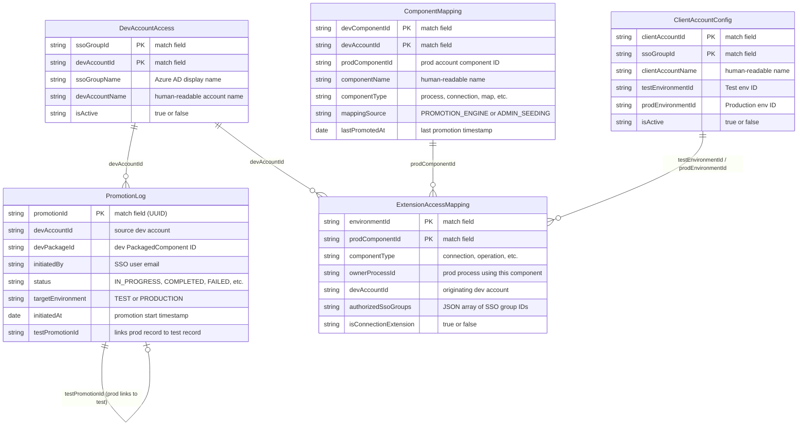

# DataHub Entity Relationship Diagram

> Referenced from [`architecture.md`](../architecture.md). See model specs in [`datahub/models/`](../../datahub/models/) for complete field definitions.

## Legend

- **PK** fields form the match rule (unique record identity in DataHub MDM)
- Only key fields shown — see individual model specs for complete field definitions
- Relationships show logical references (not enforced foreign keys — DataHub is MDM, not RDBMS)
- Cardinality: `||--o{` = one-to-many, `||--o|` = one-to-zero-or-one

## Model Specs

| Entity | Spec File | Match Rule | Source(s) |
|--------|-----------|------------|-----------|
| ComponentMapping | [`ComponentMapping-model-spec.json`](../../datahub/models/ComponentMapping-model-spec.json) | `devComponentId` + `devAccountId` | PROMOTION_ENGINE, ADMIN_SEEDING |
| DevAccountAccess | [`DevAccountAccess-model-spec.json`](../../datahub/models/DevAccountAccess-model-spec.json) | `ssoGroupId` + `devAccountId` | ADMIN_CONFIG |
| PromotionLog | [`PromotionLog-model-spec.json`](../../datahub/models/PromotionLog-model-spec.json) | `promotionId` | PROMOTION_ENGINE |
| ExtensionAccessMapping | [`ExtensionAccessMapping-model-spec.json`](../../datahub/models/ExtensionAccessMapping-model-spec.json) | `environmentId` + `prodComponentId` | PROMOTION_ENGINE, ADMIN_SYNC |
| ClientAccountConfig | [`ClientAccountConfig-model-spec.json`](../../datahub/models/ClientAccountConfig-model-spec.json) | `clientAccountId` + `ssoGroupId` | ADMIN_CONFIG, EXTENSION_ENGINE |
