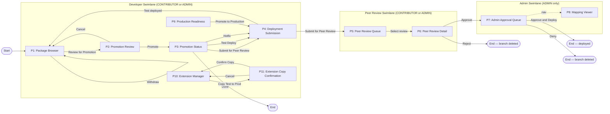

# Flow Navigation Map

> Referenced from [`flow-structure.md`](../../flow/flow-structure.md). See that file for full context.

## Legend

**Swimlane colors** correspond to authorization tiers:
- Developer Swimlane — accessible to `ABC_BOOMI_FLOW_CONTRIBUTOR` or `ABC_BOOMI_FLOW_ADMIN`
- Peer Review Swimlane — accessible to `ABC_BOOMI_FLOW_CONTRIBUTOR` or `ABC_BOOMI_FLOW_ADMIN` (self-review blocked)
- Admin Swimlane — accessible to `ABC_BOOMI_FLOW_ADMIN` only

**Node shapes:**
- Rounded rectangles (`["..."]`) — dashboard pages (P1–P11)
- Stadium/pill shapes (`(["..."])`) — flow entry/exit points

**Edge labels** — button or trigger name that causes the navigation.

**Dashed arrow** (`-.->`) from P7 to P8 — side navigation (independent page, not part of the main approval flow).

**P9 and P10/P11** are independent entry points accessible from swimlane navigation at any time; they are shown connected to the main flow at the transitions where they hand off.
