# Process C — Execute Promotion Flow

> Referenced from [`10-process-c-execute-promotion.md`](../build-guide/10-process-c-execute-promotion.md). See that file for complete build instructions.

```mermaid
flowchart TD
    START([Start: FSS Op - ExecutePromotion]) --> READREQ

    subgraph branchSetup["Branch Setup"]
        READREQ["Set Properties — Read Request\ndevAccountId, initiatedBy, rootComponentId"] --> GENID
        GENID["Data Process — Generate Promotion ID\nUUID.randomUUID()"] --> CHECKCONC

        CHECKCONC["DataHub Query\nCheck IN_PROGRESS promotions\nfor same devAccountId"] --> CONCGATE{In-progress\npromotion exists?}
        CONCGATE -- "YES" --> CONCERR["Build error response\nerrorCode: PROMOTION_IN_PROGRESS"]
        CONCERR --> RETURN1([Return Documents])
        CONCGATE -- "NO" --> QUERYBRANCH

        QUERYBRANCH["HTTP GET — QUERY Branch\nGet active branch count"] --> LIMITGATE{activeBranchCount\n>= 15?}
        LIMITGATE -- "YES (limit reached)" --> BRANCHERR["Build error response\nerrorCode: BRANCH_LIMIT_REACHED\nthreshold: 15, hard limit: 20"]
        BRANCHERR --> RETURN2([Return Documents])
        LIMITGATE -- "NO (under limit)" --> CREATEBRANCH

        CREATEBRANCH["HTTP POST — Create Branch\nname: promo-{promotionId}"] --> POLLBRANCH
        POLLBRANCH["HTTP GET — Poll Branch Ready\n5s delay, max 6 retries (30s)"] --> POLLGATE{Branch ready?}
        POLLGATE -- "NO (timeout)" --> TIMEOUTERR["errorCode: BRANCH_CREATION_TIMEOUT\nDELETE /Branch/{branchId}"]
        TIMEOUTERR --> RETURN3([Return Documents])
        POLLGATE -- "YES" --> CREATELOG

        CREATELOG["DataHub Update\nCreate PromotionLog: IN_PROGRESS\nwith branchId, branchName"] --> SORTCOMP
        SORTCOMP["Data Process — sort-by-dependency.groovy\nSort: profile → connection → operation\n→ map → sub-process → root process"] --> BATCHCONN
        BATCHCONN["DataHub Batch Query\nLoad all connection mappings\ninto connectionMappingCache"] --> VALIDATE
        VALIDATE["Data Process — validate-connection-mappings.groovy\nCheck all connections have prod mappings\nFilter connections out of component list"] --> VALIDGATE{connectionMappingsValid\n== true?}
        VALIDGATE -- "NO" --> MISSINGERR["errorCode: MISSING_CONNECTION_MAPPINGS\nUpdate PromotionLog: FAILED\nReturn missing mappings list"]
        MISSINGERR --> RETURN4([Return Documents])
        VALIDGATE -- "YES" --> LOOPSTART
    end

    subgraph perComponent["Per-Component Loop (Outer Try/Catch wraps all)"]
        LOOPSTART["For Each Component\nin dependency order"] --> TRYSTART
        TRYSTART["Try Block Start"] --> SETCURR
        SETCURR["Set Properties — Current Component\ncurrentComponentId, currentComponentName\ncurrentComponentType, currentFolderFullPath\nReset: configStripped, strippedElements, referencesRewritten"] --> GETXML
        GETXML["HTTP GET — Component XML from Dev\nGET /Component/{devComponentId}\n?overrideAccount={devAccountId}"] --> STRIPENV
        STRIPENV["Data Process — strip-env-config.groovy\nStrip: password, host, url, port, EncryptedValue\nSets: configStripped, strippedElements"] --> CHECKCACHE
        CHECKCACHE["Data Process — Check Mapping Cache\nLook up currentComponentId\nin componentMappingCache"] --> CACHEGATE{mappingExists\nin cache?}

        CACHEGATE -- "YES (skip DataHub)" --> MAPGATE
        CACHEGATE -- "NO" --> DHQUERY
        DHQUERY["DataHub Query — ComponentMapping\nFilter: devComponentId + devAccountId"] --> MAPGATE

        MAPGATE{mappingExists\n== true?}
        MAPGATE -- "YES — UPDATE path" --> REWRITEUPD
        MAPGATE -- "NO — CREATE path" --> REWRITECRE

        REWRITEUPD["Data Process — rewrite-references.groovy\nReplace all dev IDs with prod IDs\nusing componentMappingCache"] --> POSTUPD
        POSTUPD["HTTP POST — Update Component on Branch\nPOST /Component/{prodComponentId}~{branchId}\nfolderFullPath: /Promoted{currentFolderFullPath}"] --> EXTRACTUPD
        EXTRACTUPD["Extract prodVersion\naction = UPDATED"] --> UPDCACHE

        REWRITECRE["Data Process — rewrite-references.groovy\n(same as UPDATE path)"] --> POSTCRE
        POSTCRE["HTTP POST — Create Component on Branch\nPOST /Component~{branchId}\nfolderFullPath: /Promoted{currentFolderFullPath}"] --> EXTRACTCRE
        EXTRACTCRE["Extract prodComponentId, version=1\naction = CREATED"] --> UPDCACHE

        UPDCACHE["Data Process — Update Mapping Cache\nAdd devComponentId -> prodComponentId\nto componentMappingCache"] --> ACCUMULATE
        ACCUMULATE["Accumulate Result\naction, prodComponentId, prodVersion\nstatus=SUCCESS, configStripped"] --> NEXTCOMP

        NEXTCOMP{More components?}
        NEXTCOMP -- "YES" --> TRYSTART
        NEXTCOMP -- "NO" --> FAILGATE
    end

    subgraph errHandling["Error Handling"]
        CATCHBLOCK["Catch Block — Component Failure\n1. Log error with currentComponentId\n2. Add FAILED entry to results\n3. Mark dependents as SKIPPED\n4. Set anyComponentFailed = true\n5. Continue loop"] --> NEXTCOMP

        FAILGATE{anyComponentFailed\n== true?}
        FAILGATE -- "NO (all succeeded)" --> WRITEMAPPINGS
        FAILGATE -- "YES (fail-fast)" --> SKIPWRITE

        SKIPWRITE["Skip ComponentMapping writes\nPartial mappings would corrupt state"] --> LOGFAILED

        WRITEMAPPINGS["DataHub Batch Update\nWrite all ComponentMappings\nfor promoted components"] --> LOGSUCCESS

        LOGSUCCESS["DataHub Update — PromotionLog\nstatus = COMPLETED\ncomponentsCreated, componentsUpdated, componentsFailed=0"] --> BUILDSUCCESS
        BUILDSUCCESS["Map — Build Response JSON\nsuccess=true, promotionId, branchId, branchName\nresults array"] --> RETURNSUCCESS([Return Documents])

        LOGFAILED["DataHub Update — PromotionLog\nstatus = FAILED\ncomponentsCreated, componentsUpdated, componentsFailed"] --> DELBRANCH
        DELBRANCH["HTTP DELETE — Delete Branch\nDELETE /Branch/{branchId}\nDiscard all partial component writes"] --> CLEARBRANCH
        CLEARBRANCH["DataHub Update — PromotionLog\nClear branchId to empty string\nBranch no longer valid"] --> BUILDFAIL
        BUILDFAIL["Map — Build Response JSON\nsuccess=false\nerrorCode: PROMOTION_FAILED\nOmit branchId/branchName\nAll results: PROMOTED + FAILED + SKIPPED"] --> RETURNFAIL([Return Documents])
    end

    TRYSTART -.-> |"exception thrown"| CATCHBLOCK
    LOOPSTART --> TRYSTART
```

## Legend

**Node shapes:**
- `([text])` — Terminal points (Start / Return Documents)
- `{text}` — Decision diamonds (conditional branching)
- `["text"]` — Process steps (rectangles)

**Subgraphs:**
- **Branch Setup** — Steps 0 through 5.8: concurrency guard, branch creation, polling, sort, connection mapping validation
- **Per-Component Loop** — Steps 7 through 19: the core promotion loop with inner Try/Catch, XML fetch, strip, rewrite, create-or-update
- **Error Handling** — Steps 19.5 through 23: fail-fast gate, mapping writes, PromotionLog update, branch deletion on failure, response building

**Key flow paths:**
- Left/top exits from Branch Setup lead to early `Return Documents` (guard conditions)
- The component loop cycles back through the Try block for each component
- The dashed arrow from `Try Block Start` to `Catch Block` represents exception propagation
- Two terminal paths at the bottom: success (right) and fail-fast (left)

## Key Design Decisions

- **Fail-fast**: Branch is deleted on any component failure — no partial promotions. `anyComponentFailed = true` causes the fail-fast gate (step 19.5) to skip all ComponentMapping writes and immediately delete the branch.
- **Dependency order**: Components processed in type-hierarchy order (profile → connection → operation → map → sub-process → root process) so that `rewrite-references.groovy` has all necessary ID mappings in cache when processing each component.
- **Tilde syntax**: `~branchId` appended to component ID for branch-specific API calls — e.g., `POST /Component/{id}~{branchId}` writes to the promotion branch, not main.
- **Connection mappings validated BEFORE promotion**: Step 5.5–5.8 batch-queries and validates all connection mappings before the loop begins. A missing connection mapping aborts with `MISSING_CONNECTION_MAPPINGS` rather than failing mid-loop.
- **componentMappingCache pre-loaded**: Connection mappings are loaded into `componentMappingCache` during validation. The cache is NOT reset before the loop — resetting it would erase connection mappings and break reference rewriting.
- **Only COMPLETED or FAILED outcomes**: `PARTIALLY_COMPLETED` is not a valid status. The fail-fast gate ensures the system is always in a consistent state.
- **Branch limit**: Operational threshold is 15 (early warning), Boomi hard limit is 20. Process C rejects with `BRANCH_LIMIT_REACHED` when `activeBranchCount >= 15`.
- **Outer Try/Catch**: Steps 4–22 are wrapped in an outer try/catch that deletes the branch on any catastrophic failure, preventing branch leaks.
