# End-to-End Promotion Sequence

> Referenced from [`flow-service-spec.md`](../../integration/flow-service/flow-service-spec.md). See that file for complete message action specifications.

```mermaid
sequenceDiagram
    participant Dev as Developer
    participant Dash as Flow Dashboard
    participant FSS as Flow Service
    participant Eng as Integration Engine
    participant API as Platform API
    participant DH as DataHub

    rect rgb(230, 240, 255)
        Note over Dev,DH: Package Selection Phase

        Dev->>Dash: Open dashboard
        Dash->>FSS: getDevAccounts (A0)
        FSS->>Eng: invoke process A0
        Eng->>DH: query DevAccountAccess by SSO groups
        DH-->>Eng: dev account list
        Eng-->>FSS: accounts + effectiveTier
        FSS-->>Dash: getDevAccountsResponse
        Dash-->>Dev: display account selector

        Dev->>Dash: Select dev account
        Dash->>FSS: listDevPackages (A)
        FSS->>Eng: invoke process A
        Eng->>API: GET PackagedComponent (dev account)
        API-->>Eng: package list
        Eng-->>FSS: package list
        FSS-->>Dash: listDevPackagesResponse
        Dash-->>Dev: display package grid

        Dev->>Dash: Select package, click Review
        Dash->>FSS: resolveDependencies (B)
        FSS->>Eng: invoke process B
        Eng->>API: GET Component (recursive traversal)
        API-->>Eng: component XML + references
        Eng->>DH: query ComponentMapping (mapping lookup)
        DH-->>Eng: existing prod mappings
        Eng-->>FSS: dependency tree + mapping status
        FSS-->>Dash: resolveDependenciesResponse
        Dash-->>Dev: show dependency tree, flag unmapped connections
    end

    rect rgb(230, 255, 230)
        Note over Dev,DH: Promotion Execution Phase

        Dev->>Dash: Click Promote
        Dash->>FSS: executePromotion (C)
        FSS->>Eng: invoke process C
        Note over Eng: Defense-in-depth tier re-validation
        Eng->>API: POST /Branch (promo-{promotionId})
        API-->>Eng: branchId
        Note over Eng: Branch created with tilde syntax
        Eng->>DH: create PromotionLog (IN_PROGRESS)
        loop For each non-connection component
            Eng->>API: GET Component (dev account)
            API-->>Eng: component XML
            Note over Eng: Env config stripped, refs rewritten
            Eng->>API: PUT Component~branchId (prod account)
            API-->>Eng: prod componentId
            Eng->>DH: upsert ComponentMapping (dev->prod IDs)
        end
        Eng->>DH: update PromotionLog (COMPLETED + branchId)
        Eng-->>FSS: promotionResults + branchId
        FSS-->>Dash: executePromotionResponse
        Dash-->>Dev: show promotion results (Page 3)

        Dev->>Dash: Click View Diff (optional)
        Dash->>FSS: generateComponentDiff (G)
        FSS->>Eng: invoke process G
        Eng->>API: GET Component~branchId (branch version)
        Eng->>API: GET Component (main version)
        API-->>Eng: both XML versions
        Eng-->>FSS: branchXml + mainXml (normalized)
        FSS-->>Dash: generateComponentDiffResponse
        Dash-->>Dev: render side-by-side XML diff
    end

    rect rgb(255, 245, 220)
        Note over Dev,DH: Review and Approval Phase

        Dev->>Dash: Submit for Peer Review (Page 4)
        Dash->>DH: update PromotionLog (PENDING_PEER_REVIEW)
        Dash-->>Dev: email notification sent to dev + admin lists

        Note over Dev,Dash: Peer reviewer authenticates (ABC_BOOMI_FLOW_CONTRIBUTOR or ADMIN)

        Dash->>FSS: queryPeerReviewQueue (E2)
        FSS->>Eng: invoke process E2
        Note over Eng: Self-review prevention enforced
        Eng->>DH: query PromotionLog (PENDING_PEER_REVIEW, exclude own)
        DH-->>Eng: pending reviews
        Eng-->>FSS: pendingReviews list
        FSS-->>Dash: queryPeerReviewQueueResponse
        Dash-->>Dev: display peer review queue (Page 5)

        Dev->>Dash: Select promotion, click Approve (Page 6)
        Dash->>FSS: submitPeerReview (E3)
        FSS->>Eng: invoke process E3
        Note over Eng: Self-review prevention enforced
        Eng->>DH: update PromotionLog (PEER_APPROVED, PENDING_ADMIN_REVIEW)
        Eng-->>FSS: newStatus=PEER_APPROVED
        FSS-->>Dash: submitPeerReviewResponse
        Dash-->>Dev: email notification to admins + submitter

        Note over Dev,Dash: Admin authenticates (ABC_BOOMI_FLOW_ADMIN only)

        Dash->>FSS: queryStatus (E)
        FSS->>Eng: invoke process E
        Eng->>DH: query PromotionLog (PENDING_ADMIN_REVIEW)
        DH-->>Eng: promotions awaiting admin
        Eng-->>FSS: promotions list
        FSS-->>Dash: queryStatusResponse
        Dash-->>Dev: display admin approval queue (Page 7)
    end

    rect rgb(255, 230, 230)
        Note over Dev,DH: Deployment Phase

        Dev->>Dash: Admin clicks Approve and Deploy
        Dash->>FSS: packageAndDeploy (D)
        FSS->>Eng: invoke process D
        Note over Eng: Validates admin != initiator (self-approval prevention)
        Note over Eng: Gates on PromotionLog status = COMPLETED or TEST_DEPLOYED
        Eng->>API: POST /MergeRequest (OVERRIDE, branch -> main)
        API-->>Eng: mergeRequestId
        loop Poll until COMPLETED
            Eng->>API: GET /MergeRequest/{id}
            API-->>Eng: merge status
        end
        Eng->>API: POST /PackagedComponent (from main)
        API-->>Eng: packageId
        Eng->>API: POST /IntegrationPack (create or update)
        API-->>Eng: integrationPackId
        Eng->>API: POST /DeployedPackage (to target environments)
        API-->>Eng: deployment results
        Eng->>API: DELETE /Branch/{branchId}
        Eng->>DH: update PromotionLog (DEPLOYED + integrationPackId)
        Eng->>DH: write ExtensionAccessMapping (access cache refresh)
        Eng-->>FSS: deploymentResults
        FSS-->>Dash: packageAndDeployResponse
        Dash-->>Dev: show deployment confirmation + email notification
    end
```

## Legend
- Solid arrows: synchronous request/response
- Dashed arrows: async or callback responses
- Shaded rectangles group related workflow phases
- Process letter codes (A0, A, B, C, D, E, E2, E3) shown in parentheses

## Workflow Phases

1. **Package Selection** — Developer browses and selects packages for promotion. Calls `getDevAccounts` (A0) to resolve SSO groups to dev accounts, `listDevPackages` (A) to query packages from the chosen account, and `resolveDependencies` (B) to recursively traverse component references and check existing mappings.

2. **Promotion Execution** — System creates a `promo-{promotionId}` branch via the Platform API (tilde syntax), promotes each non-connection component with env config stripped and dev IDs rewritten to prod IDs, and records the promotion in PromotionLog. Process G (`generateComponentDiff`) is available on demand at this stage and in the review phase for side-by-side XML comparison.

3. **Review and Approval** — 2-layer approval workflow: the developer submits for peer review, which moves the PromotionLog to `PENDING_PEER_REVIEW`. A peer reviewer (any CONTRIBUTOR or ADMIN except the submitter) queries the queue via `queryPeerReviewQueue` (E2) and approves/rejects via `submitPeerReview` (E3). Self-review is enforced at both the backend (case-insensitive email comparison) and UI (Decision step) levels. On peer approval, the record advances to `PENDING_ADMIN_REVIEW`. An admin then queries via `queryStatus` (E) and makes the final decision.

4. **Deployment** — Admin approves and triggers `packageAndDeploy` (D). Process D validates that the admin is not the promotion initiator (self-approval prevention), gates on `COMPLETED` or `TEST_DEPLOYED` PromotionLog status, merges the branch to main via OVERRIDE MergeRequest, creates a PackagedComponent, publishes to an Integration Pack, deploys to target environments, deletes the branch, updates PromotionLog to `DEPLOYED`, and rebuilds the ExtensionAccessMapping cache for the new components.

## Alternative Paths Not Shown

- **Test deployment path**: Developer deploys to test env first (Page 4, `deploymentTarget="TEST"`). Branch is preserved. Developer later promotes from Page 9 using `queryTestDeployments` (E4). Process D skips the merge step (content already on main) when `testPromotionId` is populated.
- **Emergency hotfix**: Developer marks the promotion as hotfix on Page 3. Flows through peer and admin review with hotfix badge and mandatory justification. Process D merges directly to production.
- **Withdrawal**: Initiator can withdraw a `PENDING_PEER_REVIEW` or `PENDING_ADMIN_REVIEW` promotion via `withdrawPromotion` (E5), which deletes the branch and frees a branch slot.
- **Rejection**: Peer rejection or admin denial deletes the branch and notifies the submitter. Main is never modified.
